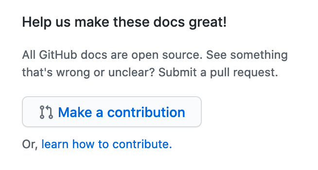

## GitHub Docs <!-- omit in toc -->

This repository contains the documentation website code and Markdown source files for [docs.github.com](https://docs.github.com).

GitHub's Docs team works on pre-production content in a private repo that regularly syncs with this public repo.

In this article:
- [Contributing](#contributing)
- [READMEs](#readmes)
- [License](#license)
- [Contributors ✨](#contributors-)

## Contributing

### Start contributing right now:

We accept a lot of [different contributions](CONTRIBUTING.md/#types-of-contributions-memo), including some that don't require you to write a single line of code.

#### Click **make a contribution** from docs

As you're using the GitHub Docs, you may find something in an article that you'd like to add to, update, or change. Click on **make a contribution** to navigate directly to that article in the codebase, so that you can begin making your contribution.

#### Open an issue

If you've found a problem, you can open an issue using a [template](https://github.com/github/docs/issues/new/choose).

#### Solve an issue

If you have a solution to one of the open issues, you will need to fork the repository and submit a PR using the [template](https://github.com/github/docs/blob/main/CONTRIBUTING.md#pull-request-template) that is visible automatically in the pull request body. For more details about this process, please check out [Getting Started with Contributing](/CONTRIBUTING.md). 

#### Join us in discussions

We use GitHub Discussions to talk about all sorts of topics related to documentation and this site. For example: if you'd like help troubleshooting a PR, have a great new idea, or want to share something amazing you've learned in our docs, join us in [discussions](https://github.com/github/docs/discussions).

#### And that's it!
That's how you can get started easily as a member of the GitHub Documentation community. :sparkles:

If you want to know more, or you're making a more complex contribution, check out [Getting Started with Contributing](/CONTRIBUTING.md).

There are a few more things to know when you're getting started with this repo:

1. If you're having trouble with your GitHub account, contact [Support](https://support.github.com/contact).
2. We do not accept pull requests for translated content - see [CONTRIBUTING.md](/CONTRIBUTING.md) for more information.

## READMEs

In addition to the README you're reading right now, this repo includes other READMEs that describe the purpose of each subdirectory in more detail:

- [content/README.md](content/README.md)
- [contributing/README.md](contributing/README.md)
- [data/README.md](data/README.md)
- [data/reusables/README.md](data/reusables/README.md)
- [data/variables/README.md](data/variables/README.md)
- [includes/liquid-tags/README.md](includes/liquid-tags/README.md)
- [includes/README.md](includes/README.md)
- [javascripts/README.md](javascripts/README.md)
- [layouts/README.md](layouts/README.md)
- [lib/liquid-tags/README.md](lib/liquid-tags/README.md)
- [middleware/README.md](middleware/README.md)
- [script/README.md](script/README.md)
- [stylesheets/README.md](stylesheets/README.md)
- [tests/README.md](tests/README.md)

## License

The GitHub product documentation in the assets, content, and data folders are licensed under a [CC-BY license](LICENSE).

All other code in this repository is licensed under a [MIT license](LICENSE-CODE).

When using the GitHub logos, be sure to follow the [GitHub logo guidelines](https://github.com/logos).

## Contributors ✨

Thanks goes to these wonderful people ([emoji key](https://allcontributors.org/docs/en/emoji-key)):

<!-- ALL-CONTRIBUTORS-LIST:START - Do not remove or modify this section -->
<!-- prettier-ignore-start -->
<!-- markdownlint-disable -->
<table>
  <tr>
    <td align="center"><a href="https://github.com/alebourne"> <b>Alexandra Bourne</b></a> <a href="#content-alebourne" title="Content">🖋</a> <a href="https://github.com/github/docs/issues?q=author%3Aalebourne" title="Bug reports">🐛</a></td>
    <td align="center"><a href="http://cynthiarich.me/"> <b>Cynthia Rich</b></a> <a href="#content-crichID" title="Content">🖋</a> <a href="https://github.com/github/docs/issues?q=author%3AcrichID" title="Bug reports">🐛</a></td>
    <td align="center"><a href="https://github.com/emilyistoofunky"> <b>Emily Gould</b></a> <a href="#content-emilyistoofunky" title="Content">🖋</a> <a href="https://github.com/github/docs/issues?q=author%3Aemilyistoofunky" title="Bug reports">🐛</a></td>
    <td align="center"><a href="https://github.com/felicitymay"> <b>Felicity Chapman</b></a> <a href="#content-felicitymay" title="Content">🖋</a> <a href="https://github.com/github/docs/issues?q=author%3Afelicitymay" title="Bug reports">🐛</a></td>
    <td align="center"><a href="https://heiskr.com/"> <b>Kevin Heis</b></a> <a href="https://github.com/github/docs/issues?q=author%3Aheiskr" title="Bug reports">🐛</a> <a href="https://github.com/github/docs/commits?author=heiskr" title="Code">💻</a></td>
    <td align="center"><a href="https://github.com/hubwriter"> <b>Alistair Christie</b></a> <a href="#content-hubwriter" title="Content">🖋</a> <a href="https://github.com/github/docs/issues?q=author%3Ahubwriter" title="Bug reports">🐛</a></td>
    <td align="center"><a href="https://jamesmgreene.github.io/"> <b>James M. Greene</b></a> <a href="https://github.com/github/docs/issues?q=author%3AJamesMGreene" title="Bug reports">🐛</a> <a href="https://github.com/github/docs/commits?author=JamesMGreene" title="Code">💻</a></td>
  </tr>
  <tr>
    <td align="center"><a href="https://github.com/janiceilene"> <b>Janice</b></a> <a href="#content-janiceilene" title="Content">🖋</a> <a href="https://github.com/github/docs/issues?q=author%3Ajaniceilene" title="Bug reports">🐛</a></td>
    <td align="center"><a href="https://jasonet.co"> <b>Jason Etcovitch</b></a> <a href="https://github.com/github/docs/issues?q=author%3Ajasonetco" title="Bug reports">🐛</a> <a href="https://github.com/github/docs/commits?author=jasonetco" title="Code">💻</a></td>
    <td align="center"><a href="https://github.com/jf205"> <b>James Fletcher</b></a> <a href="#content-jf205" title="Content">🖋</a> <a href="https://github.com/github/docs/issues?q=author%3Ajf205" title="Bug reports">🐛</a></td>
    <td align="center"><a href="https://github.com/jleaver"> <b>Jenn Leaver</b></a> <a href="#content-jleaver" title="Content">🖋</a> <a href="https://github.com/github/docs/issues?q=author%3Ajleaver" title="Bug reports">🐛</a></td>
    <td align="center"><a href="https://github.com/jmarlena"> <b>jmarlena</b></a> <a href="#content-jmarlena" title="Content">🖋</a> <a href="https://github.com/github/docs/issues?q=author%3Ajmarlena" title="Bug reports">🐛</a></td>
    <td align="center"><a href="https://johnwargo.com/"> <b>John M. Wargo</b></a> <a href="#content-jwargo" title="Content">🖋</a> <a href="https://github.com/github/docs/issues?q=author%3Ajwargo" title="Bug reports">🐛</a></td>
    <td align="center"><a href="https://github.com/lecoursen"> <b>Laura Coursen</b></a> <a href="#content-lecoursen" title="Content">🖋</a> <a href="https://github.com/github/docs/issues?q=author%3Alecoursen" title="Bug reports">🐛</a></td>
  </tr>
  <tr>
    <td align="center"><a href="https://lucascosti.com/"> <b>Lucas Costi</b></a> <a href="#content-lucascosti" title="Content">🖋</a> <a href="https://github.com/github/docs/issues?q=author%3Alucascosti" title="Bug reports">🐛</a></td>
    <td align="center"><a href="https://github.com/martin389"> <b>Martin Lopes</b></a> <a href="#content-martin389" title="Content">🖋</a> <a href="https://github.com/github/docs/issues?q=author%3Amartin389" title="Bug reports">🐛</a></td>
    <td align="center"><a href="https://github.com/mattpollard"> <b>Matt Pollard</b></a> <a href="#content-mattpollard" title="Content">🖋</a> <a href="https://github.com/github/docs/issues?q=author%3Amattpollard" title="Bug reports">🐛</a></td>
    <td align="center"><a href="https://github.com/mchammer01"> <b>mc</b></a> <a href="#content-mchammer01" title="Content">🖋</a> <a href="https://github.com/github/docs/issues?q=author%3Amchammer01" title="Bug reports">🐛</a></td>
    <td align="center"><a href="http://meaganbird.com/"> <b>Meg Bird</b></a> <a href="#content-megbird" title="Content">🖋</a> <a href="https://github.com/github/docs/issues?q=author%3Amegbird" title="Bug reports">🐛</a></td>
    <td align="center"><a href="https://github.com/myarb"> <b>Melanie Yarbrough</b></a> <a href="#content-myarb" title="Content">🖋</a> <a href="https://github.com/github/docs/issues?q=author%3Amyarb" title="Bug reports">🐛</a></td>
    <td align="center"><a href="https://github.com/rachmari"> <b>Rachael Sewell</b></a> <a href="#content-rachmari" title="Content">🖋</a> <a href="https://github.com/github/docs/issues?q=author%3Arachmari" title="Bug reports">🐛</a></td>
  </tr>
  <tr>
    <td align="center"><a href="https://github.com/runleonarun"> <b>Leona B. Campbell</b></a> <a href="#content-runleonarun" title="Content">🖋</a> <a href="https://github.com/github/docs/issues?q=author%3Arunleonarun" title="Bug reports">🐛</a></td>
    <td align="center"><a href="https://github.com/sarahs"> <b>Sarah Schneider</b></a> <a href="https://github.com/github/docs/issues?q=author%3Asarahs" title="Bug reports">🐛</a> <a href="https://github.com/github/docs/commits?author=sarahs" title="Code">💻</a></td>
    <td align="center"><a href="https://github.com/shati-patel"> <b>Shati Patel</b></a> <a href="#content-shati-patel" title="Content">🖋</a> <a href="https://github.com/github/docs/issues?q=author%3Ashati-patel" title="Bug reports">🐛</a></td>
    <td align="center"><a href="http://kathy.pm/"> <b>Kathy Korevec</b></a> <a href="#content-simpsoka" title="Content">🖋</a> <a href="https://github.com/github/docs/issues?q=author%3Asimpsoka" title="Bug reports">🐛</a></td>
    <td align="center"><a href="https://github.com/timeyoutakeit"> <b>Amy Burns</b></a> <a href="#content-timeyoutakeit" title="Content">🖋</a> <a href="https://github.com/github/docs/issues?q=author%3Atimeyoutakeit" title="Bug reports">🐛</a></td>
    <td align="center"><a href="https://github.com/vanessayuenn"> <b>Vanessa Yuen</b></a> <a href="https://github.com/github/docs/issues?q=author%3Avanessayuenn" title="Bug reports">🐛</a> <a href="https://github.com/github/docs/commits?author=vanessayuenn" title="Code">💻</a></td>
    <td align="center"><a href="http://zeke.sikelianos.com/"> <b>Zeke Sikelianos</b></a> <a href="https://github.com/github/docs/issues?q=author%3Azeke" title="Bug reports">🐛</a> <a href="https://github.com/github/docs/commits?author=zeke" title="Code">💻</a></td>
  </tr>
  <tr>
    <td align="center"><a href="https://github.com/BenJam"> <b>Benjamin Nickolls</b></a> <a href="https://github.com/github/docs/commits?author=BenJam" title="Documentation">📖</a></td>
    <td align="center"><a href="https://mcaffer.com"> <b>Jeff McAffer</b></a> <a href="https://github.com/github/docs/commits?author=jeffmcaffer" title="Documentation">📖</a></td>
    <td align="center"><a href="https://tjenkinson.me"> <b>Tom Jenkinson</b></a> <a href="https://github.com/github/docs/commits?author=tjenkinson" title="Code">💻</a></td>
    <td align="center"><a href="https://github.com/casals"> <b>Arthur Casals</b></a> <a href="#content-casals" title="Content">🖋</a> <a href="https://github.com/github/docs/commits?author=casals" title="Documentation">📖</a></td>
    <td align="center"><a href="https://www.arangodb.com/"> <b>Simran</b></a> <a href="https://github.com/github/docs/commits?author=Simran-B" title="Documentation">📖</a></td>
    <td align="center"><a href="https://github.com/ruth"> <b>Ruth</b></a> <a href="#content-Ruth" title="Content">🖋</a></td>
    <td align="center"><a href="http://tomaszwisniewski.com"> <b>Tomasz Wisniewski</b></a> <a href="https://github.com/github/docs/commits?author=wi5nia" title="Documentation">📖</a></td>
  </tr>
  <tr>
    <td align="center"><a href="https://chiedojohn.com/"> <b>Chiedo John</b></a> <a href="https://github.com/github/docs/commits?author=chiedo" title="Code">💻</a></td>
    <td align="center"><a href="https://wanderingmonster.org"> <b>Paul Schifferer</b></a> <a href="#content-paulyhedral" title="Content">🖋</a></td>
    <td align="center"><a href="https://www.kewindousse.ch"> <b>Kewin Dousse</b></a> <a href="#content-Protectator" title="Content">🖋</a></td>
  </tr>
</table>

<!-- markdownlint-enable -->
<!-- prettier-ignore-end -->
<!-- ALL-CONTRIBUTORS-LIST:END -->

This project follows the [all-contributors](https://github.com/all-contributors/all-contributors) specification. Contributions of any kind welcome!
