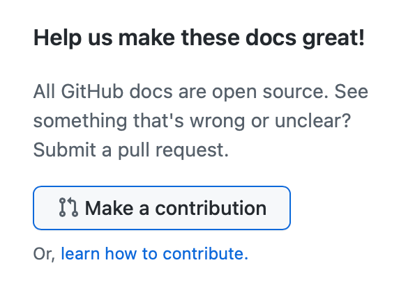

# GitHub Docs <!-- omit in toc -->

This repository contains the documentation website code and Markdown source files for [docs.github.com](https://docs.github.com).

GitHub's Docs team works on pre-production content in a private repo that regularly syncs with this public repo.

Use the table of contents icon  on the top left corner of this document to navigate to a specific section quickly.

For more complex contributions, please open an issue using the most appropriate [issue template](https://github.com/github/docs/issues/new/choose) to describe the changes you'd like to see.

If you're looking for a way to contribute, you can scan through our [help wanted board](https://github.com/github/docs/issues?q=is%3Aopen+is%3Aissue+label%3A%22help+wanted%22) to find open issues already approved for work.

### And that's it!

If you're having trouble with your GitHub account, contact [Support](https://support.github.com).

That's how you can easily become a member of the GitHub Docs community. :## READMEs

In addition to the README you're reading right now, this repo includes other READMEs that describe the purpose of each subdirectory in more detail:

## COPYRIGHT License

The GitHub product documentation in the assets, content, and data folders are licensed
