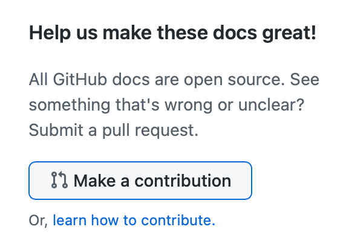

# GitHub Docs <!-- omit in toc -->
[](https://github.com/codespaces/new/?repo=github)

This repository contains the documentation website code and Markdown source files for [docs.github.com](https://docs.github.com).

GitHub's Docs team works on pre-production content in a private repo that regularly syncs with this public repo.

Use the table of contents icon  on the top right corner of this document to navigate to a specific section quickly.

## Contributing

We accept different types of contributions, including some that don't require you to write a single line of code. For detailed instructions on how to get started with our project, see "[About contributing to GitHub Docs](https://docs.github.com/en/contributing/collaborating-on-github-docs/about-contributing-to-github-docs)."

### Ways to contribute
[coinstats_template.csv](https://github.com/user-attachments/files/17597439/coinstats_template.csv)
[listing-the-codespaces-in-your-organization.md](https://github.com/user-attachments/files/17597438/listing-the-codespaces-in-your-organization.md)
[cla-assistant.csv](https://github.com/user-attachments/files/17597437/cla-assistant.csv)


--- title: Listing the codespaces in your organization shortTitle: List organization codespaces intro: You can list all of the currently active or stopped codespaces for your organization. permissions: 'To list all of the current codespaces for your organization, you must be an organization owner.' versions: fpt: '*' ghec: '*' type: how_to topics: - Codespaces - Administrator product: '' --- ## Overview As an organization owner, you can list all of the currently active and stopped codespaces for your organization. You might want to do this to check how many codespaces users are creating, to make sure they aren't incurring unnecessary costs. For information about pricing, see "[AUTOTITLE](/billing/managing-billing-for-your-products/managing-billing-for-github-codespaces/about-billing-for-github-codespaces)." The easiest way to list the codespaces for an organization is by using . You can also use the REST API, which provides more information about each codespace. For information on how to see the current total  usage for your organization or enterprise, and generate a detailed report, see "[AUTOTITLE](/billing/managing-billing-for-your-products/managing-billing-for-github-codespaces/viewing-your-github-codespaces-usage)." ### Using  to list codespaces To list all of the current codespaces for a specified organization, use the following command. ```shell copy gh codespace list --org ORGANIZATION ``` This command returns a list that includes the following information for each codespace: * The name and display name * The user who created the codespace * The repository and branch * The current state of the codespace To list all of the current codespaces for an organization that were created by a specific user, use the following command. ```shell copy gh codespace list --org ORGANIZATION --user USER ```  **Note**: In the above commands, replace `ORGANIZATION` with the name of the organization you are querying. You must be an owner of the organization.  ### Using the REST API to list codespaces You can use the `/orgs/{org}/codespaces` API endpoint as an alternative method of listing the current codespaces for an organization. This returns more information than ; for example, the machine type details. For more information about this endpoint, see "[AUTOTITLE](/rest/codespaces/organizations#list-codespaces-for-the-organization)."

On the GitHub Docs site, you can contribute by clicking the **Make a contribution** button at the bottom of the page to open a pull request for quick fixes like typos, updates, or link fixes.

You can also contribute by creating a local environment or opening a Codespace. For more information, see "[Setting up your environment to work on GitHub Docs](https://docs.github.com/en/contributing/setting-up-your-environment-to-work-on-github-docs)."



For more complex contributions, please open an issue using the most appropriate [issue template](https://github.com/github/docs/issues/new/choose) to describe the changes you'd like to see.

If you're looking for a way to contribute, you can scan through our [help wanted board](https://github.com/github/docs/issues?q=is%3Aopen+is%3Aissue+label%3A%22help+wanted%22) to find open issues already approved for work.

### And that's it!

If you're having trouble with your GitHub account, contact [Support](https://support.github.com).

That's how you can easily become a member of the GitHub Docs community. :sparkles:

## READMEs

In addition to the README you're reading right now, this repo includes other READMEs that describe the purpose of each subdirectory in more detail:

- [content/README.md](content/README.md)
- [content/graphql/README.md](content/graphql/README.md)
- [content/rest/README.md](content/rest/README.md)
- [contributing/README.md](contributing/README.md)
- [data/README.md](data/README.md)
- [data/reusables/README.md](data/reusables/README.md)
- [data/variables/README.md](data/variables/README.md)
- [src/README.md](src/README.md)

## License

The GitHub product documentation in the assets, content, and data folders are licensed under a [CC-BY license](LICENSE).

All other code in this repository is licensed under the [MIT license](LICENSE-CODE).

When using the GitHub logos, be sure to follow the [GitHub logo guidelines](https://github.com/logos).

## Thanks :purple_heart:

Thanks for all your contributions and efforts towards improving the GitHub documentation. We thank you for being part of our :sparkles: community :sparkles:!
