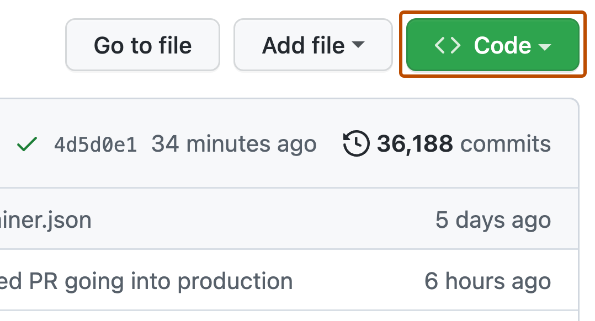

# Content style guide for GitHub Docs <!-- omit in toc -->

Welcome to the content style guide for [GitHub Docs](https://docs.github.com/).

These guidelines are specific to GitHub’s documentation. For general style questions or guidance on topics not covered here, see the [Microsoft Style Guide](https://docs.microsoft.com/style-guide/welcome/). For markup specific to source content on docs.github.com, see our [markup reference guide](content-markup-reference.md). For any questions about the GitHub brand, see our "[GitHub Brand Guide](https://brand.github.com)"

Use table of contents icon  on the top right corner of this document to get to a specific section of this guide quickly.

## The GitHub Docs approach to style

- Our style guide aims for simplicity. Guidelines should be easy to apply to a range of scenarios.
- Decisions aren’t about what’s right or wrong according to the rules of grammar or the style guide, but about what’s best for our users. We're flexible and open to change while maintaining consistency.
- To scale the style guide as our team and documentation sets grow, and to create high-quality, meaningful content that serves users, we focus our attention on high-impact, high-value scenarios rather than attempting to comprehensively cover every style question.
- Consistency and grammatical correctness are important, but not as important as clarity and meaning.
- When making a style or structure decision, we consider the flow of information within the unit of content and the context of the information.
- When a question specific to help documentation isn’t covered by the style guide, we think it through using these principles, then make a decision. If a reviewer asks about it, we're prepared to discuss the decision.

## Callouts

Callouts highlight important information that customers need to know. We use standard formatting and colors for different types of callouts across doc sets.

Use callouts sparingly for high-value information - do not include general information, permissions, or prerequisites in callouts. Do not include more than two bullet points in a callout.

There are three types of in-content callouts: notes, warnings, and danger notices.

### Formatting callouts

Each callout starts with text indicating the type of callout (e.g. **Warning**:) to orient the reader (whether accessing the site visually or with a screen reader) and helps every user gauge the importance and necessity of the information in the callout.

Notes are rendered in blue `` tags.
- Notes provide useful information or reminders for the user, but the information is not required to follow. Notes may not be relevant or necessary to every user.
- Precede note content with `**Note:**`.

Warnings and danger notices are rendered in red `` tags.
- Warnings are potentially dangerous actions that a user should heed before continuing with a task. They are often non-optional steps.
  - Precede content with `**Warning:**`.
- Danger notices are dangerous actions that a user should exercise extreme caution before performing. They often involve the potential for data loss or other destructive actions.
  - Precede content with `**Danger:**`.

For more information on formatting callouts, see “Callouts” in the [markup reference guide](content-markup-reference.md).

## Call to action (CTA) buttons

CTA buttons emphasize a link that we expect or encourage readers to navigate to after reading an article or as part of completing the task that an article describes. CTAs should only take people to GitHub-owned domains. For example, the CTA in "[Getting started with GitHub Copilot in Visual Studio Code](https://docs.github.com/en/copilot/getting-started-with-github-copilot/getting-started-with-github-copilot-in-visual-studio-code)" links to the [GitHub Copilot settings menu](https://github.com/settings/copilot) on github.com.

Only include a CTA button if navigating to the link supports user needs. Do not use CTA buttons solely for marketing GitHub features or products. In the above example, someone who wants to try Copilot must navigate to the GitHub Copilot settings menu and would likely want to after reading the article. In contrast, even though someone might use Copilot as part of writing code that they then create a pull request for, we would not add a "Try GitHub Copilot" CTA to "[Creating a pull request](https://docs.github.com/en/pull-requests/collaborating-with-pull-requests/proposing-changes-to-your-work-with-pull-requests/creating-a-pull-request)" since Copilot is not connected to the user needs of "Creating a pull request." Most people will create pull requests without using Copilot. But people visiting articles about getting started with Copilot are probably interested in trying Copilot if they are not already using it. So we add the CTA button to help people get where they are trying to go.

Style your CTAs using the following format.

`<a href="https://github.com/DESTINATION/URL" target="_blank" class="btn btn-primary mt-3 mr-3 no-underline"><span>Try PRODUCT NAME</span> </a>`

## Code

### Code blocks

Keep lines in code samples to about 60 characters, to avoid requiring readers to scroll horizontally in the code block. Locate explanatory text before the code block, rather than using comments inside the code block. See "[Code sample syntax highlighting](./content-markup-reference.md#code-sample-syntax-highlighting)" for more information on the syntax and formatting of code blocks.

Within code blocks:
- Do not use markup before the command output.
- Only use `$` before the command itself if you’re showing the command’s output in the same block.
  - If you show a command and the command's output, do not make the code block copyable.
- If your code example includes `{` or `}` that should render, wrap that section in `` `` to disable Liquid processing for that section.
- If your code example includes content that should be parsed (for example, HTML tags to format text), wrap that section in `<pre>` `</pre>` tags to parse rather than escape the content in the section.
  - **Use**:

    ```
    GITHUB_TOKEN: ${{ secrets.GITHUB_TOKEN }}
    ```

  - **Avoid**:

    ```
    GITHUB_TOKEN: ${{ secrets.GITHUB_TOKEN }}
    ```

### Commands

Use inline code blocks to refer to short command names.
- **Use:** To check the status of a running cluster, use the `ghe-cluster-status` command.

Use command blocks for longer or more complex commands.
- **Use:** Enable maintenance mode according to your scheduled window by connecting to the administrative shell of any cluster node and running:

  ```
  ghe-cluster-maintenance -s
  ```

Avoid inline links in command names.

### Examples

When code examples refer to a larger file, show the relevant section of the file, so that users understand how to edit their own code in context.
- **Use:**

```
on:
  schedule:
    - cron:  "40 19 * * *"
```

- **Avoid:**

```
schedule:
  - cron:  "40 19 * * *"
```

### File and directory names

Use inline codeblocks to refer to file and directory names. If a file type generally follows a specific capitalization convention, such as all caps for README files, use the established convention.

- **Use:** In your `README.md` file, add info about your repository.
- **Use:** In your `.github/workflows/` directory, create the `example-workflow.yml` file.
- **Avoid:** In your _.github/workflows/_ directory, create the `example-workflow.yml` file.
- **Avoid:** Delete the **example.js** file.

### Indentation

In YAML examples, such as actions and workflow files, use two spaces to indent lines within nested lists and block sequences.

- **Use:**

```yaml
    steps:
      - uses: 
      - name: Setup Python
        uses: 
        with:
          python-version: ${{ matrix.python }}
```

### Scheduled workflows

Workflow runs are delayed when too many workflows run at once. Since many users copy code from the GitHub docs, we should use examples that guide users away from congested times.

- Do not use examples that run on the hour. (The Actions team reports that times at the start of the hour, especially UTC midnight, are disproportionately overloaded.)
- Do not use examples that run more frequently than necessary. For example, instead of running every 5 minutes, consider if the example makes sense to run every 30 minutes instead.
- Use a different time for each example.

## Footnotes

Avoid using footnotes where possible. Consider instead whether you could use a [callout](https://github.com/github/docs/blob/main/contributing/content-style-guide.md#callouts) or present the information in another way. See some [examples of alternatives to footnotes from NICE.org.uk](https://www.nice.org.uk/corporate/ecd6/chapter/footnotes).

If you must use footnotes:

* Use numbers. Do not use typographical symbols or special characters.
* Place footnote markers in square brackets: `[1]`.
* Do not use superscript.

## Headers

Headers must adequately describe the content under it. Follow the same guidelines we use for writing titles. Each header on a page must be unique.

Use H2 for headers, and H3 for subheaders. Articles must start with an H2 level header and cannot skip header levels. There must be content between a header and subheader, such as an introduction. When referring to headers, surround the header name with quotation marks.
- **Use:** Under "User licenses," view your total licenses.

For more information, see the [content model](/contributing/content-model.md#titles).

## Images

We use static images including screenshots, diagrams, and graphs throughout the docs to complement textual information.

Do not use animated GIFs in the docs.

### Alt text

Every image must include alt text providing a textual equivalent of the visual information.

- Express the core idea or meaning of the image, rather than describing it literally.
- Use 40–150 characters.
- End with a period.
- Don't start with "Image..." or "Graphic...". Screen readers say this automatically.
- Do begin with the _type_ of graphic: "Screenshot of..." or "Diagram that shows..."
- Follow standard language used to describe UI elements in article text.
- Put multi-word titles, e.g. names of menu items, in double quotation marks ("").
- If an area of the image is visually highlighted, describe how. This enables screen-reader users to understand and describe to a sighted friend/colleague what to look for from a visual language standpoint.

#### Alt text for screenshots

Alt text provides a short description of a screenshot's content to benefit people who cannot see it.

- Alt text only needs to include the most relevant elements of an image, not every detail.
- Alt text is not intended to provide instructions for using the GitHub interface. These should be included in accompanying article text.

##### Format

> Screenshot of the `Product name` + `UI element` shown. The `UI element` + `state of the element/controls`, and its `keyboard shortcut XYZ`, are outlined in dark orange.

- For `Product name`, use the GitHub product or feature name, such as "GitHub Actions" or "GitHub repository," rather than just "GitHub."
- Use a variable for the word `GitHub` as we do in running copy: ``
- Describe UI elements consistently with written documentation.
- Be flexible with word order when needed for clarity.
  - For example, write "Screenshot of the Debug menu in Visual Studio Code..." rather than "Screenshot of the Visual Studio Code Debug menu...," to avoid multiple nouns in a row.

##### Examples

> Screenshot of the  committers by repository table. The horizontal kebab icon and "Download CSV report" button are outlined in dark orange.

> Screenshot of file options in a  repository. A button with an arrow indicating a dropdown menu, labeled "Code," is outlined in dark orange.



#### Alt text for diagrams and graphs

Explain the information conveyed in the diagram or graph in text on the page.

Use alt text to express the core idea of the image, without duplicating the webpage text.

##### Example

> Diagram showing a five-step process by which a GitHub Actions runner can be automatically added to named classes of runners and then requested by specific jobs.

[See accompanying explanation of this diagram in the Actions documentation.](https://docs.github.com/en/actions/using-github-hosted-runners/using-larger-runners#architectural-overview-of-larger-runners)

#### Alt text for images of command-line interfaces

Do not use screenshots of command-line interfaces to convey commands and their output. Instead, directly provide the commands a user should use. For more information, see the "[Commands](#commands)" section of the style guide.

When using a screenshot of a command-line interface to show user interface elements, follow standard alt text guidelines for screenshots.

### Filenames

Be descriptive when naming image files: include the name, action, and UI element in the filename. Mirror product language. Use kebab case. Do not use Liquid conditionals in filenames. If replacing an image, use the exact filename.
- **Use:** `data-pack-purchase-button.png`
- **Avoid:** `purchase_button.png`
- **Avoid:** `purchase-button-for-admins.png`

### Screenshots

To learn about creating and versioning images, see "[Creating and updating screenshots](./images-and-versioning.md)."

## Inclusive language

As home to the largest developer community in the world, GitHub is committed to promoting diversity and inclusion in every aspect of what we do. It is critical that all of our documentation is inclusive and respectful of our audience, which consists of people in widely varying circumstances from all over the planet. When we write our documentation, we use words that are inclusive, anti-racist, and accessible.

Individual words might be small, but together they can create community, belonging, and equity. Be empathetic in all word and style choices. Be accurate when referring to people and communities.

| Use | Avoid |
| --- | --- |
| Allowlist | Whitelist |
| Denylist | Blacklist |
| Default/Main branch | Master branch |

### Resources about inclusive language

The Microsoft Style Guide offers resources on bias-free communication, accessibility terms, and writing for all abilities:
- [Bias-free communication](https://docs.microsoft.com/style-guide/bias-free-communication)
- [Writing for all abilities](https://docs.microsoft.com/style-guide/accessibility/writing-all-abilities)
- [Accessibility terms](https://docs.microsoft.com/style-guide/a-z-word-list-term-collections/term-collections/accessibility-terms)

More resources for learning about inclusive and accessible language and style:
- [18F Content Guide on Inclusive Language](https://content-guide.18f.gov/inclusive-language/)
- MailChimp Content Style Guide:
  - [Writing About People](https://styleguide.mailchimp.com/writing-about-people/)
  - [Writing for Accessibility](https://styleguide.mailchimp.com/writing-for-accessibility/)
- [Readability Guidelines](https://readabilityguidelines.co.uk/)
- [Conscious Style Guide](https://consciousstyleguide.com/)

## Keyboard shortcuts

For presenting keyboard shortcuts, follow the [Microsoft Style Guide](https://docs.microsoft.com/en-us/style-guide/a-z-word-list-term-collections/term-collections/keys-keyboard-shortcuts), **except for the following differences**:

- Use the HTML `<kbd>` tag for each individual key.

  - **Use:** `<kbd>Command</kbd>+<kbd>B</kbd>`
  - **Avoid:** `Command+B`
- Use full words instead of symbols for Apple modifier keys.

  - **Use:** `Command`
  - **Avoid:** `⌘`
- Use symbols for keys of special character, not full words.

  - **Use:** `.`, `,`, and `→`.
  - **Avoid:** `Period`, `Comma`, and `Right arrow`.

### Usage highlights

Below are some usage highlights for how we present keyboard shortcuts in our documentation:

- The basic syntax is to show keys with `+` between key combinations, without any spaces.

  - **Use:** `<kbd>Command</kbd>+<kbd>B</kbd>`, which is rendered as <kbd>Command</kbd>+<kbd>B</kbd>.
  - **Avoid:** `<kbd>Command</kbd> + <kbd>B</kbd>` or `<kbd>Command + B</kbd>` which are  rendered as <kbd>Command</kbd> + <kbd>B</kbd> or <kbd>Command + B</kbd>.
- Always capitalize letter keys for general references and keyboard shortcuts.

  - **Use:** <kbd>Command</kbd>+<kbd>B</kbd>
  - **Avoid:** <kbd>Command</kbd>+<kbd>b</kbd>.
- Use the correct modifier keys for the each operating system.

  **Note:** Windows and Linux have <kbd>Ctrl</kbd> abbreviated, whereas on Mac it is spelled in full: <kbd>Control</kbd>.

  - For Windows and Linux:

    - **Use:** <kbd>Ctrl</kbd>, <kbd>Alt</kbd>.
    - **Avoid:** <kbd>Control</kbd>
  - For Mac:

    - **Use:** <kbd>Command</kbd>, <kbd>Option</kbd>, <kbd>Control</kbd>.
    - **Avoid:** <kbd>Cmd</kbd>, <kbd>⌘</kbd>, <kbd>Opt</kbd>, <kbd>⌥</kbd>, <kbd>Ctrl</kbd>, <kbd>⌃</kbd>
- Don't confuse key combinations with keys in a sequence.

  - <kbd>Command</kbd>+<kbd>B</kbd> indicates that the user should hold down the <kbd>Command</kbd> key and press the <kbd>B</kbd> key.
  - <kbd>G</kbd> <kbd>I</kbd> indicates that the user should press the <kbd>G</kbd> key, then press the <kbd>I</kbd> key.
- When describing a keyboard shortcut for multiple operating systems, append the operating system in brackets after the shortcut. Describe the Mac shortcut first, then Windows/Linux.

  - **Use:** `<kbd>Command</kbd>+<kbd>B</kbd> (Mac) or <kbd>Ctrl</kbd>+<kbd>B</kbd> (Windows/Linux)`, presented as:

     <kbd>Command</kbd>+<kbd>B</kbd> (Mac) or <kbd>Ctrl</kbd>+<kbd>B</kbd> (Windows / Linux)
  - **Avoid:** `<kbd>Ctrl</kbd>+<kbd>B</kbd> or <kbd>Command</kbd>+<kbd>B</kbd>`, presented as:

    <kbd>Ctrl</kbd>+<kbd>B</kbd> or <kbd>Command</kbd>+<kbd>B</kbd>

## Licensed content

GitHub Docs is licensed under a [CC-BY license](https://github.com/github/docs/blob/main/LICENSE). If you reuse or modify licensed content in an article, you must make sure that the license is compatible and properly attributed.

Do not create reusables for license attributions. We must use the exact license a project is licensed under, so any attributions must be accurately written for the articles that they appear in.

If you are unsure of the legality of reusing any content, contact legal. If you are adding content with a license that is not listed below, you must receive a legal review before you can publish the content.

### Attributing MIT-licensed content

If we reuse or modify content under an MIT license, we must attribute the MIT license where the content appears.

At the end of the article containing MIT-licensed content
- Create a header titled `Legal notice`
- Attribute where the content comes from and that it is licensed under the MIT license. Include a link to the project
- Paste the full text of the MIT license from the project that you are attributing in a codeblock

#### Example MIT license attribution

This text is only an example. Always use the license text from the project you are attributing.

`````
## Legal notice

Portions have been adapted from [PROJECT](link/to/project) under the MIT license:

```
MIT License

Copyright <YEAR> <COPYRIGHT HOLDER>

Permission is hereby granted, free of charge, to any person obtaining a copy of this software and associated documentation files (the "Software"), to deal in the Software without restriction, including without limitation the rights to use, copy, modify, merge, publish, distribute, sublicense, and/or sell copies of the Software, and to permit persons to whom the Software is furnished to do so, subject to the following conditions:

The above copyright notice and this permission notice shall be included in all copies or substantial portions of the Software.

THE SOFTWARE IS PROVIDED "AS IS", WITHOUT WARRANTY OF ANY KIND, EXPRESS OR IMPLIED, INCLUDING BUT NOT LIMITED TO THE WARRANTIES OF MERCHANTABILITY, FITNESS FOR A PARTICULAR PURPOSE AND NONINFRINGEMENT. IN NO EVENT SHALL THE AUTHORS OR COPYRIGHT HOLDERS BE LIABLE FOR ANY CLAIM, DAMAGES OR OTHER LIABILITY, WHETHER IN AN ACTION OF CONTRACT, TORT OR OTHERWISE, ARISING FROM, OUT OF OR IN CONNECTION WITH THE SOFTWARE OR THE USE OR OTHER DEALINGS IN THE SOFTWARE.
```

`````

## Linebreaks

For plain text, use linebreaks to separate paragraphs in the source (two consecutive linebreaks), rather than to create visual space in the source. Avoid unneeded linebreaks, especially in lists.

## Links

Introduce links consistently using a standard format that clearly indicates where we're linking.

For any link that points to another GitHub docs page, use the special keyword `AUTOTITLE`. See details in the [content markup reference](./content-markup-reference.md#internal-links-with-autotitle).

Usage examples:

- For links to other pages: `For more information, see "[AUTOTITLE](/path/to/page)."`
- For links to sections in other pages: `For more information, see "[AUTOTITLE](/path/to/page#section-link)."`
- For links to a page with a tool selected: `For more information, see the TOOLNAME documentation in "[AUTOTITLE](/path/to/page?tool=TOOLNAME).`

Same-page section links do **not** work with `AUTOTITLE`. Instead, type out the full header text: `For more information, see "[Header text](#section-link)."`

For links to external documentation, type out the full article name: `For more information, see [Page or article title](https://some-docs.com/path/to/page) in the X documentation.`

Do not include quotation marks within a hyperlink.

Some best practices for using links:
- Links should be meaningful and provide high value to the user’s journey—link out carefully.
- Move links that are helpful but not necessary to an article’s further reading section.
- Do not repeat the same link more than once in the same article or under the same H2 header.
- Do not include the `apiVersion` query parameter in REST links unless you need to link to a specific calendar version of the REST docs. (This should be a rare occurance.)

For accessibility and readability, avoid inline or midsentence links.
- **Use:** OAuth2 tokens can be acquired programmatically for applications that are not websites. For more information, see "[Setting up and registering OAuth Apps](https://developer.github.com/apps/building-integrations/setting-up-and-registering-oauth-apps/)" and "[Create a new authorization](https://docs.github.com/en/enterprise-server@2.22/rest/reference/oauth-authorizations/#create-a-new-authorization)."
- **Avoid:** Read [more about OAuth2.](https://developer.github.com/apps/building-integrations/setting-up-and-registering-oauth-apps/) Note that OAuth2 tokens can be [acquired programmatically](https://docs.github.com/en/enterprise-server@2.22/rest/reference/oauth-authorizations/#create-a-new-authorization), for applications that are not websites.

For more information on links and accessibility, see “[Links](https://readabilityguidelines.co.uk/content-design/links/)” in the Readability Guidelines project.

### Links between versions

Sometimes, you need to link from one version of GitHub Docs to another. When you want to link to a different version of the _same_ page, you should use the `currentArticle` property.

For example, the Free, Pro, & Team version of "[Managing the publication of GitHub Pages sites for your organization](https://docs.github.com/en/organizations/managing-organization-settings/managing-the-publication-of-github-pages-sites-for-your-organization)" might link to the Enterprise Cloud version of the same article like this:

>You can choose to allow or disallow the publication of GitHub Pages sites.
>
>Organizations that use GitHub Enterprise Cloud can choose to allow publicly published sites, privately published sites, both, or neither. For more information, see [the GitHub Enterprise Cloud documentation](/enterprise-cloud@latest/{{ currentArticle }}).

To link to a different article in a different version, use this format:

> For more information, see "[ARTICLE TITLE]()" in the VERSION documentation.

To link to the same article in a different version, use this format:

> For more information, see [the VERSION documentation](/VERSION/{{ currentArticle }}).

To link to a specific version, you must include the version in the path (e.g., `/enterprise-cloud@latest/{{ currentArticle }}`).

### Links to specific sections of articles

When we link to specific sections of articles, we want to make sure the link is descriptive enough so that someone knows they are in the correct spot after following a link.

To link to a specific header in the same article, use this format:
> For more information, see "[HEADER TITLE](#HEADER-TITLE)."

To link to a specific header in a different article, use this format:
> For more information, see "[ARTICLE TITLE](path-to-article#HEADER-TITLE)."

### Links to a specific tool

When we link to content with a specific tool selected, we want to make sure that someone knows that they will be looking at content relevant to a specific tool even if they do not view the tool switcher tabs in the article.

> For more information, see the TOOLNAME documentation in "[ARTICLE TITLE](/PATH/TO/ARTICLE?tool=TOOLNAME)."

### Links to learning paths

Use this format to link to a learning path.

> For more information, follow the "[LEARNING PATH TITLE]()" learning path.

### Links to external resources

When linking to an external site, choose the most useful resource for the context of the link - you can link to a whole site if it's a general reference or to a specific page if that would be more helpful.

It's not necessary to link to an external product’s website when we mention an external product.

## Lists

Capitalize the first letter in each line of a list. Use periods at the end of lines in a list only if the line contains a complete sentence.

When writing a list of items that consist of primary and secondary text, such as a `term` and its definition, use a colon delimiter. The secondary text should be capitalized as if it was the beginning of the line. For example:
* `foo`: Something that provides bar.
* `bar`: Something provided by foo.

Formatting unordered lists:
- If the order of items in the list is not important, alphabetize the list items.
- If the order is important, then order the list by the importance to the reader (for example, moving from broadest audience and applicability to a more specialized audience).

When introducing a list, avoid phrasing like “the following” or “these”, terms which are difficult to localize. Instead, be descriptive, yet general enough to allow a list to scale or change without having to update the description.

## Procedural steps

Procedures give readers a set of sequential steps to follow to complete a task. Always use numbered lists for procedures. Give readers all of the prerequisites or conceptual information they’ll need to complete the task before the procedure, rather than including it within a specific step.

Each step must include an action. You can also choose to include whether a step is optional, explain the reason or result of the step, and orient the reader by describing the location of the action, before guiding them to complete the action.

Use a consistent order to present information within each step.
1. If the step is optional, indicate that first.
2. When needed for clarity, or to reinforce the severity of a destructive or confusing action, explain the reason for or result of the step.
3. Describe the location the user will find the action in.
4. Action.

**Use:** Optionally, to [REASON], in [LOCATION], take [ACTION].

Examples:
- Click **Payment information**.
- Under your organization name, click **Settings**.
- To confirm your change, click **Remove credit card**.
- Optionally, to see your plan’s details, click **Show details**.
- Under "GitHub Sponsors", to the right of the sponsored open source contributor, click [down arrow octicon] next to your sponsored amount, then click **Change tier**.

## Product names

Use full product names. Do not abbreviate or shorten product names unless directly reproducing content from the product (e.g. UI copy or API responses).

Use product name variables to render product names - do not write product names in plain text. This makes product name changes easier to implement across the site and avoids typos in our product names. For more information about product name variables, see “Reusables and variables” in this document and the data directory of the github/docs repository.

Product names are always singular.
- **Use:** GitHub Actions helps you automate your software development workflows.
- **Avoid:** GitHub Actions help you automate your software development workflows.

Take care to distinguish between product names and product elements.

| Product | Element |
| --- | --- |
| GitHub Actions | an action |
| GitHub Codespaces | a codespace |
| GitHub Packages | a package |
| GitHub Pages | a GitHub Pages site |

## Product-specific conventions

This section describes additional conventions that are specific to GitHub products.

### GitHub Actions

#### Reusables for first-party actions

Code examples that use first-party actions must use the respective reusable for that action. This makes action version updates (e.g. from `v1` to `v2`) easier to manage for products like GitHub Enterprise Server, which might not have the same action version available until a future Enterprise Server release.

Action reusables are located in `/data/reusables/actions/` and have a filename like `action-<action_name>.md`

For example, to use the `actions/checkout` action in an example, use its reusable:

```yaml
steps:
  - name: Checkout
    uses: 
```

For GitHub Docs purposes, a first-party action is any action that has the `actions/`, `github/` or `octo-org/` prefix. For example, this is a first-party action:

```
steps:
  - uses: actions/checkout@main
```

#### Disclaimers for third-party actions

Code examples that use third-party actions must include the following disclaimer as part of the code block:

```
# This workflow uses actions that are not certified by GitHub.
# They are provided by a third-party and are governed by
# separate terms of service, privacy policy, and support
# documentation.
```
To insert this disclaimer, use the `` reusable. If the code block is indented, you must use `indented_data_reference` along with the reusable. For example:

```

```

For GitHub Docs purposes, a third-party action is any action that doesn't have the `actions/`, `github/` or `octo-org/` prefix. For example, this is a first-party action:

```
steps:
  - uses: actions/checkout@main
```

This is an example of a third-party action:

```
steps:
    - uses: google-github-actions/setup-gcloud@daadedc81d5f9d3c06d2c92f49202a3cc2b919ba
```

Examples:
- See the code block in "[Publishing to package registries](https://docs.github.com/en/actions/guides/building-and-testing-python#publishing-to-package-registries)"

#### Pinning version numbers to SHA

Code examples that use third-party actions must always pin to a full length commit SHA, instead of the version number or branch:

```
steps:
    - uses: google-github-actions/setup-gcloud@daadedc81d5f9d3c06d2c92f49202a3cc2b919ba
```

For GitHub Docs purposes, a third-party action is any action that doesn't have one of the following prefixes: `actions/`, `github/`, and `octo-org/`. For example, this is a first-party action:

```
steps:
  - uses: actions/javascript-action@main
```

For more information, see "[Using SHAs](https://docs.github.com/en/actions/learn-github-actions/finding-and-customizing-actions#using-shas)"

### GitHub Codespaces

When referring to the product GitHub Codespaces, always include "GitHub", except in these circumstances:
* In the `shortTitle` front matter (i.e. the abbreviated version of the article title).
* In subheadings within an article, if "GitHub Codespaces" has already been used anywhere in the article prior to the subheading.

Variables: `` ("GitHub Codespaces") and `` ("Codespaces").

When referring to instances of remote working environments created with this technology, refer to these as "codespaces" (lowercase c). For example, "to delete your codespace" or "to list your codespaces."

Always use "dev container" (or, where clarification is needed, its longer form "development container") and not "devcontainer" (one word), except in file/path names. The single word could form could be considered a brand, which we want to avoid, and we also want to be consistent with the two-word form used in [the Visual Studio Code documentation](https://code.visualstudio.com/docs/remote/create-dev-container#_path-to-creating-a-dev-container).

Use "development container configuration files" to refer to all of the files in the `.devcontainer` directory (plus the `.devcontainer.json` if that's being used rather than `devcontainer.json` in the `.devcontainer` directory). Don't refer to these as "development container files" or "devcontainer files" to avoid this being taken as referring to `devcontainer.json` files. "Development container configuration files" refers to all of the files that can be used to configure a dev container, including `Dockerfile` and `docker-compose.yml` files. Don't use "the development container configuration file" (singular) when referring specifically to a `devcontainer.json` file. Instead refer to this file by its name.

### GitHub Advanced Security (GHAS)

Use the terms `licenses` and `active committers` when you refer to GitHub Advanced Security billing.

We used to use the term `seats` to describe the number of accounts that can use GitHub Advanced Security in an enterprise. People can be confused by the term `seats`, so we removed this term from GitHub.com in autumn 2022 and versions from GHES/GHAE 3.7 onward do not use it.

### Personal access tokens

GitHub has two types of personal access tokens:

- Fine-grained personal access tokens: Offer granular control over repository access and permissions
- Personal access tokens (classic): Use scopes and grant access to all repositories that the token owner can access

You should use variables to refer to these types of tokens, as well as to personal access tokens in general:

- Use ``or `` to refer to personal access tokens in general. Use `` if the phrase should be in title case ("Personal Access Token") in order to match UI text.
- Use `` or `` to refer to fine-grained personal access tokens.
- Use ``, ``, ``, or `` to refer to personal access tokens (classic).

For more information about GitHub's personal access tokens, see "[Creating a personal access token](https://docs.github.com/en/authentication/keeping-your-account-and-data-secure/creating-a-personal-access-token#about-personal-access-tokens)."

## Punctuation

Follow standard American English punctuation rules. For more guidance, see “[Punctuation](https://docs.microsoft.com/style-guide/punctuation)” in the Microsoft Style Guide.

## Reusables and variables
Use reusable strings for individual nouns (e.g. product names) or for complete sentences or paragraphs. Sentence fragments and phrases should not be contained in reusable strings as they can cause problems when content is localized. For more information, see the [data directory](../data) in the github/docs repository and the “[Product names](#product-names)” section of this document.

## Sectional TOCs

If a section of an article uses `H3` or `H4` headers to further divide the content and only some of the content is relevant to a reader, you can use a sectional table of contents (TOC) to help readers identify and navigate to the information that is most relevant to them. For example, in "[Streaming the audit log for your enterprise](https://docs.github.com/en/enterprise-cloud@latest/admin/monitoring-activity-in-your-enterprise/reviewing-audit-logs-for-your-enterprise/streaming-the-audit-log-for-your-enterprise#setting-up-streaming-to-amazon-s3)" people will probably only set up audit log streaming for one provider, so the sectional TOC in "Setting up audit log streaming" allows people to select their provider and navigate to the relevant content without reading the entire section.

Do not add a sectional TOC if `H3` or `H4` headers are used only to group content and all information could be of relevance to a reader. For example, in "[About authentication for your enterprise](https://docs.github.com/en/enterprise-cloud@latest/admin/identity-and-access-management/managing-iam-for-your-enterprise/about-authentication-for-your-enterprise#identifying-the-best-authentication-method-for-your-enterprise)," people should read and consider each section as it relates to their enterprise. We do not include a sectional TOC in this article because people should be reading through each section, not picking and choosing between them. Adding a sectional TOC would also force people who use screenreaders or other adaptive technology to tab and scroll through more headers before finding what they need.

Format sectional TOCs as a list. Include all subsections in the order that they appear in the article and refer to them using the full header title.

Sectional TOCs must be introduced with a sentence or paragraph that helps people understand how the content is organized and select the section that is most relevant to them. Do not include a sectional TOC directly beneath a header.

### Example of sectional TOCs

```
## Setting up the application

Set up your application according to your operating system.

- [Setting up for macOS](#setting-up-for-macOS)
- [Setting up for Windows](#setting-up-for-windows)
- [Setting up for Linux](#setting-up-for-linux)

### Setting up for macOS

TEXT

### Setting up for Windows

The application is supported for all versions of Windows, but the set up steps differ.

- [Windows 98](#windows-98)
- [Windows Vista](#windows-vista)
- [Windows 11](#windows-11)

#### Windows 98

TEXT

#### Windows Vista

TEXT

#### Windows 11

TEXT

### Setting up for Linux

TEXT
```

## Tables

### Use tables only for presenting tabular information
Tables work best for presenting tabular data, such as information that needs to be compared or values with multiple attributes. Do not use tables for simple lists - see the "[Lists](https://github.com/github/docs/blob/main/contributing/content-style-guide.md#lists)" section of this document.

### Avoid describing table data
A table’s data and why it is important should be clear from any preceding content, the column headers, and (if needed) the row headers. Avoid unneeded descriptions of the data in a table. If the data in a table is unclear without a lengthy description, consider if your table needs row headers or if the information would be better communicated in a different way.

For example, in "[Autoscaling with self hosted runners](https://docs.github.com/en/actions/hosting-your-own-runners/autoscaling-with-self-hosted-runners#recommended-autoscaling-solutions)," a table comparing the features between two supported autoscaling solutions is introduced with the sentence `Each solution has certain specifics that may be important to consider.` The article does not describe any of the different features that are compared because that information is clearly communicated by the table.

- **Use:** "Different size limits per repository apply depending on your GHES version."
- **Avoid:** "The first row of the table shows the information for GitHub Enterprise Cloud. The second row shows the information for GitHub Enterprise Server."
- **Avoid:** “The table below shows what kind of migration data is exported.”

### Use proper markup for row and column headers

Tables in which the first column describes the data values in the table (but is not data itself) need to be marked up with row headers. This is important for assistive technology to understand relationships between cells. 

For example in the following table, in order to make sense of the "Yes" and "No" values in the table, you need to know both the column header (role) and row header (permission).

<table>
  <tr>
    <th>Organization permission</th>
    <th>Owners</th>
    <th>Members</th>
    <th>Moderators</th>
    <th>Billing managers</th>
    <th>Security managers</th>
  </tr>
  <tr>
    <th>Create repositories</th>
    <td>Yes</td>
    <td>Yes</td>
    <td>Yes</td>
    <td>No</td>
    <td>Yes</td>
  </tr>
  <tr>
    <th>View and edit billing information</th>
    <td>Yes</td>
    <td>No</td>
    <td>No</td>
    <td>Yes</td>
    <td>No</td>
  </tr>
  <tr>
    <th>Invite people to join the organization</th>
    <td>Yes</td>
    <td>No</td>
    <td>No</td>
    <td>No</td>
    <td>No</td>
  </tr>
</table>

To add row headers for a Markdown table, wrap the table in the Liquid tags ` `. For more information about using row headers, see "[Table row headers](./content-markup-reference.md#table-row-headers)" in the content markup reference.

### Include a value for every cell
Every cell in a table must contain a value. If the table has row headers, the first cell (cell A1) can be empty.

If there is no data, use "None" or "Not applicable". Do not use "NA" or "N/A".

### Use clear, consistent symbols and labels

For tables that use symbols:

* Populate all cells. For example in a permissions table, do not mark only the cells for things that require a permission.
* Use [octicons](https://github.com/github/docs/blob/main/contributing/content-markup-reference.md#octicons) or SVG. Do not use emoji.
* Use a [check mark](https://primer.style/octicons/check-16) for affirmative values ("Yes", "Required", "Supported") and a [cross](https://primer.style/octicons/x-16) for negative values ("No", "Optional", "Unsupported").
* Use `aria-label` to describe the meaning of the symbol, not its visual characteristics. For example, "Required", not "Check mark icon".

Where table data is not truly binary (every value is either "Yes" or "No", for example), text values may be needed in addition to, or instead of, symbols. For example on the page "[About GitHub Support](https://docs.github.com/en/support/learning-about-github-support/about-github-support)", some features are marked as "Available to purchase".

### Use footnotes sparingly
See "[Footnotes](https://github.com/github/docs/blob/main/contributing/content-style-guide.md#footnotes)."

## Titles

Use quotation marks around article titles, whether the article is hosted on GitHub Docs or elsewhere. Do not include quotation marks around the names of external sites.

For further guidance, see “[Formatting titles](https://docs.microsoft.com/style-guide/text-formatting/formatting-titles)” in Microsoft’s Style Guide.

## Short titles
We use short titles to populate the sidebar navigation. They should give users contextual understanding of the article, but align to the following standards:

- Short titles are 2-3 words long, yet should still convey the full meaning of the title.
- To help cut words, look at the title in context:
  - Are there words in the breadcrumb that you can omit in the short title?
  - Remove repeated words possible
- Don’t introduce new words in short titles that aren’t in the full title
- Short titles should be parallel to short titles for similar content
  - **Use:**
    - Organizations and teams
    - Enterprise accounts
- Short titles should still mimic format of the full title
  - For task-based titles, if there’s a preposition or object or it’s otherwise awkward to shorten, try to find a verb but you can use a nouns when needed

| Instead of | Use |
|---|---|
| Authenticating to GitHub | Authentication |
| Installing and configuring GHE Server | Installation and configuration |

## User interface elements

### Boldface

Use bold to describe UI elements that can be interacted with.
- In the left sidebar, click **Billing**.
- Look in the merge box at the bottom of the pull request's **Conversation** tab.
- Next to **Title**, add a descriptive label for your new key.

### Branch names

Use code formatting for branch names.
- `main`
- `<username>.github.io`

### Buttons

Format button names in bold and, whenever possible, omit the word “button.” To describe using a button, write “click”, not push or press.
- **Use:** Click **Pull request**.
- **Avoid:** Press the Pull request button.

### Checkboxes

Format checkbox names in bold and omit the word “checkbox.” To describe choosing or clearing a checkbox, use “select” or “deselect.”
- **Use:** Select **Enable for all new repositories**.
- **Avoid:** Check the “Enable for all new repositories” checkbox.

### Dynamic text

Use capital letters to indicate text that changes in the user interface or that the user needs to supply in a command or code snippet.
- **Use:** Click **Add USERNAME to REPONAME**.

### Lists and list items

Format lists and clickable list items in bold. To describe interacting with a list, such as a dropdown menu or UI element that expands, regardless of whether the list name is a word or an octicon, write "select." To describe choosing a list item, write "click."
- **Use:** Select the **Backup email addresses** dropdown menu and click **Only allow primary email**.
- **Avoid:** Click the "Backup email addresses" dropdown menu and click **Only allow primary email**.

### Location

Describe a user interface element’s location with standard terms.
- Under or above
- Next to
- Upper-left, upper-right, lower-left, lower-right
- Top of the page, bottom of the page, right side of the page, left side of the page

### Radio buttons

Format radio button labels in bold and omit the words “radio button” or any other descriptor. To describe using a radio button, write "select."

### Repository names

Use a standard format to refer to repositories. Link to repositories when helpful.
- **Use:** in the [account-name/repository-name](URL) repository

### User interface text

When referencing text in the user interface, reproduce the text exactly. Use quotation marks to surround UI text that cannot be interacted with.
- **Use:** Under “IP allow list”, click **Edit**.

### More resources
Microsoft Style Guide:
- [Formatting text in instructions](https://docs.microsoft.com/style-guide/procedures-instructions/formatting-text-in-instructions)

## Videos

You may add videos to reinforce text-based information but videos should never replace written content. Videos are inaccessible to some users and are also difficult to find by searching.

Videos on the GitHub Docs website must be well-produced and accessible, and conform to our content model for videos. For more information, see "[Using videos in GitHub Docs content](./videos.md)."

## Voice and tone

Use clear, simple language that’s approachable and accessible for a wide range of readers. To learn more about writing approachable content, see “[Microsoft's brand voice: Above all, simple and human](https://docs.microsoft.com/style-guide/brand-voice-above-all-simple-human) and “[Top 10 tips for Microsoft style and voice](https://docs.microsoft.com/style-guide/top-10-tips-style-voice).”

## Word choice and terminology

For general guidance and GitHub-specific terms, see our "[Glossary](https://docs.github.com/en/get-started/quickstart/github-glossary)". For more detailed guidance, see the “[A-Z word list](https://docs.microsoft.com/style-guide)” in Microsoft’s style guide.

### Abbreviations

Spell out words except when referring to a word that’s explicitly shortened in the product itself.
- **Use:** Repository
- **Avoid:** Repo
- **Use:** Administrator, people with admin permissions
- **Avoid:** Admins

Do not use symbols or octicons that aren’t used in GitHub’s user interface.
- **Use:** Click **File**, then click **Edit**.
- **Avoid:** Click **File > Edit**.

### Accounts

#### Product names and accounts

To avoid ambiguity and confusion, do not use product names as adjectives to describe accounts in any of our products. Instead, clarify the account type and choose clearer phrasing that avoids conflating accounts and products. When talking about accounts, only refer to the product name when needed to disambiguate between products. For more information about types of accounts available in GitHub's products, see "[Types of GitHub accounts](https://docs.github.com/en/get-started/learning-about-github/types-of-github-accounts)."
- **Use:** Your organization on GitHub Enterprise Cloud
- **Avoid:** Your GitHub Enterprise Cloud account
- **Avoid:** Your GitHub Enterprise Server organization
- **Use:** You can highlight your work on GitHub Enterprise Server by sending the contribution counts to your GitHub.com profile.

#### Individual people's accounts on GitHub

We refer to an account that an individual person signs into in various ways depending on the context.

Unless the content is about administering an enterprise product, describe an individual person's account on GitHub as a "personal account." This creates consistency with the UI and prevents readers from being confused by seeing two terms that mean the same thing.

- **Use:** Managing scheduled reminders for your personal account
- **Avoid:** Managing scheduled reminders for your user account

#### Accounts for enterprise products

With GitHub's enterprise products, administrators manage an enterprise account. An enterprise account can own multiple organizations, and people's user accounts can be members of the organizations. For more information, see the "Roles in an enterprise" article for each product.

- [GitHub Enterprise Cloud](https://docs.github.com/en/enterprise-cloud@latest/admin/user-management/managing-users-in-your-enterprise/roles-in-an-enterprise)
- [GitHub Enterprise Server](https://docs.github.com/en/enterprise-server/admin/user-management/managing-users-in-your-enterprise/roles-in-an-enterprise)
- [GitHub AE](https://docs.github.com/en/github-ae@latest/admin/user-management/managing-users-in-your-enterprise/roles-in-an-enterprise)

If the reader manages an enterprise account, and you're describing the people's accounts that they manage, use "user account." This applies to the following products.

- GitHub Enterprise Cloud with Enterprise Managed Users
  - **Use:** With Enterprise Managed Users, you can create and manage user accounts for your enterprise members.
  - **Avoid:** With Enterprise Managed Users, you can create and manage the personal accounts for your enterprise members.
- GitHub Enterprise Server
  - **Use:** If you need to temporarily take over a user account...
  - **Avoid:** If you need to temporarily take over a personal account...
- GitHub AE
  - **Use:** Authorized users can access your enterprise from any IP address.
  - **Avoid:** Authorized personal accounts can access your enterprise from any IP address.

The following documentation should reference "user accounts."

- The "[Enterprise administrators](https://docs.github.com/en/enterprise-cloud@latest/admin)" product
- Enterprise-specific billing documentation, like "[About billing for your enterprise](https://docs.github.com/en/enterprise-cloud@latest/billing/managing-billing-for-your-github-account/about-billing-for-your-enterprise)"
- Content within other products that's intended for an administrative audience, like "[Best practices for securing accounts](https://docs.github.com/en/enterprise-cloud@latest/code-security/supply-chain-security/end-to-end-supply-chain/securing-accounts)" in the "Code security" product or "[Setting up a trial of GitHub Enterprise Cloud](https://docs.github.com/en/enterprise-cloud@latest/get-started/signing-up-for-github/setting-up-a-trial-of-github-enterprise-cloud)" in the "Get started" product
- Enterprise-specific API content, like the "[GitHub Enterprise administration](https://docs.github.com/en/enterprise-cloud@latest/rest/reference/enterprise-admin)" REST API reference documentation

For enterprises on GitHub Enterprise Cloud that don't use Enterprise Managed Users, use "personal account" when describing members of organizations owned by the enterprise.

- **Use:** If you configure SAML SSO, members of your organization will continue to sign into their personal accounts on GitHub.com.
- **Avoid:** If you configure SAML SSO, members of your organization will continue to sign into their user accounts on GitHub.com.

Documentation that describes GitHub Enterprise Cloud without Enterprise Managed Users is generally in the "[Managing SAML single sign-on for your organization](https://docs.github.com/en/enterprise-cloud@latest/organizations/managing-saml-single-sign-on-for-your-organization)" category.

#### People's accounts for other services

When you describe a person's account for a service other than GitHub, such as an integration or authentication provider, use "user account."
### Acronyms

Spell out acronyms the first time they’re used in an article, except in titles or headers.

### Apps

Use "apps" or "applications" in general content.
- **Use:** Publish and list your apps in GitHub Marketplace

Use "Apps" when referring to specific apps or types of apps.
- **Use:** GitHub App, OAuth App

GitHub Apps is always capitalized, because it’s a feature name.

### Currency

When referring to dollars, cents, amounts of currency or using the `$` sign, ensure the currency used is defined even if the amount is zero. Use the [ISO standard currency name](https://www.iso.org/iso-4217-currency-codes.html), and the [ISO standard currency code](https://www.six-group.com/en/products-services/financial-information/data-standards.html#scrollTo=currency-codes) where possible.

Use lowercase for currency names, but capitalize the reference to the country or region.
- **Use:** US dollar.
- **Avoid:** US Dollar, $USD dollar.

Use uppercase for currency codes.
- **Use:** USD.

Where there is only one reference in an article, use the currency name without a `$` sign preceding the amount.
- **Use:** `10 US dollars` for a single reference to currency.

Where an article contains several references to the same currency, ensure that the first reference uses the currency name without a `$` sign preceding the amount and includes the currency code in parentheses following the currency name.

For subsequent references to currency in an article or where appropriate (such as when space is a consideration, or when several amounts are presented in a table or list), include the `$` sign preceding the amount and use the ISO standard currency code following the amount.
- **Use:** `10 US dollars (USD)` for the first reference, and `$0.25 USD` for subsequent references.
- **Avoid:** `$10 US dollars (USD)`, `USD$0.25`.

Where the first reference concerns `cents` or a non-dollar amount, capitalize the reference to the country or region of the currency used in parentheses immediately after the first reference. Subsequent currency references are treated using the guidelines above.

- **Use:** `99 cents (US currency)` for the first reference, and `99 cents` for subsequent references.
- **Avoid:** `$0.99 (US currency)`, `$0.99 USD cents`, `USD$0.99 cents`.

### Inclusive language

See the “Inclusive language” section of this guide.

### Permissions

A **permission** is the ability to perform a specific action. For example, the ability to delete an issue is a permission.

A **role** is a set of permissions that can be assigned to a user. Roles exist at different levels.

- Accounts (e.g., organization owner, billing manager for an enterprise account)
- Resources (e.g., "Write" for a repository, "Admin" for a security advisory)
- Teams (e.g., "team maintainer")

A person's **access** refers generally to all the abilities the person has in a particular context, regardless of which roles or individual permissions those abilities come from.

Only use **permission** or **role** when the distinction between the two is important. Otherwise, use **access**.

- **Use:** `To create a custom repository role, you choose an inherited role and then add individual permissions.`
- **Use:** `Managing a team's access to your organization's repository`
- **Use:** `If your team membership gives you a different level of access than your role as organization owner...`
- **Use:** `People with write access can...`
- **Avoid:** `People with the write role can...`
- **Avoid:** `People with write permissions can...`
- **Avoid:** `People with write privileges can...`

When specifying the access required to take an action, refer only to the role at the same level as the action. For example, you need admin access to a repository, which is a repository-level role, to configure protected branches. You can get admin access to a repository by being an organization owner, an organization-level role, but the repository-level role is what actually governs your ability to take the action, so that is the only role that should be mentioned.

- **Use:** `People with write access to a repository can do X to the repository.`
- **Avoid:** `Organization owners and people with write access can do X to the repository.`

For more information about word choice for permissions statements, see "[Permissions statements](/contributing/content-model.md#permissions-statements)" in the content model.

### Prepositions

Avoid ending a sentence with a preposition unless the rewritten sentence would sound awkward or too formal.

### Product names

See the “[Product names](#product-names)” section of this guide.

### Terms to use or avoid

| Use | Avoid |
| --- | --- |
| person | user, customer |
| terminal | shell |
| username | login |
| sign in  | log in, login |
| sign up | signup |
| recommended limit | soft limit |
| email | e-mail |
| on GitHub | on a remote repository |
| press (a key) | hit, tap |
| type (in the user interface) | enter (in the user interface) |
| enter (in the command line) | type (in the command line) |

## Word order

### Strings of nouns

Avoid stacked modifiers (strings of nouns), which can lead to incorrect translations because translations may not be able to tell which word is modifying the other. You can rephrase the string of nouns using a preposition. If using a stacked modifier is essential, make sure the background information and context are clear so that readers and the translator can understand what is being modified.
- **Use:** Default source settings for public repositories
- **Avoid:** Public repository default source settings
