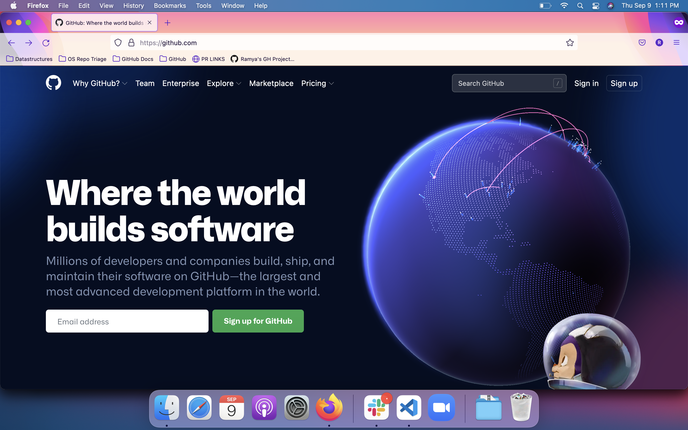

# Creating and updating screenshots

Screenshots are used to help readers with the flow in articles like procedures (as in "[Creating a repository from a template](https://docs.github.com/en/github/creating-cloning-and-archiving-repositories/creating-a-repository-from-a-template)"), and conceptual articles about areas of the UI (as in "[Configuring notifications](https://docs.github.com/en/github/managing-subscriptions-and-notifications-on-github/configuring-notifications#about-participating-and-watching-notifications)").

## Best practices for taking screenshots

- Screenshots enhance our content but can't replace it. 
- Include descriptive alt text for better accessibility. 
- Ensure we're publishing strong standalone content along with screenshots.
- When replacing an existing image (such as for an updated button in the UI), best practice is to retain the image's filename. If you must change an image filename, search the help docs repository for other references to that image and update all references to the original filename. If the image is used in deprecated versions of GHES documentation, please don't change the filename.
- Screenshots should have descriptive names to make them easier to find. For example, use the name `gist-embed-link.png` instead of `right_side_page_03.png`.
- Try to avoid overly large screenshots. For example, if you're trying to bring attention to a button, don't take a shot of the entire page. Focus on the area around the button instead. Crop down near the focal point of the image, but leave enough of a margin around it so that some other elements of the page are visible to provide context.
- Ensure screenshot is always taken in light mode. 
- Replace your username and avatar with [Octocat's](https://github.com/octocat) username and avatar. You can do this using the developer tools in your browser to edit the rendered page.

Here's an example of a good cropping:
  
  

Here's an example of a bad cropping:
  
  
  

## Versioning images in Markdown content

Some images apply to all GitHub plans (Free, Pro and Team; GitHub Enterprise Server; GitHub AE; and GitHub Enterprise Cloud). In this case, there is no versioning required. When an image does differ from plan to plan or changes in a newer release of Github Enterprise server or GitHub AE, the images need to be versioned with [Liquid](liquid-helpers.md) conditional statements. The Liquid conditional versioning may need to be added when the content is initially created, or may need to be added when the content is updated for a feature update or Enterprise release.

### Image locations
Images are located in the `/assets/images` directory. This directory has some folders that can be used to organize content by plan and release number.

- `/assets/images/enterprise/github-ae`: Images that are _only_ applicable to GitHub AE (and not applicable to any other plan).
- `/assets/images/enterprise/enterprise-server`: Images that are applicable to _all_ releases of GitHub Enterprise Server or are applicable to the current release and future releases.
- `/assets/images/enterprise/<release number>`: Ex: `/assets/images/enterprise/3.0/`. When an image is changed in a new GitHub Enterprise Server release, add the new image and move the old image to the directory corresponding to the last release that it should be displayed in.
- `/assets/images`: Images that apply to the Free, Pro, Team plan or images that are not specific to any Enterprise plan.

### Example: An image differs between free-pro-team and all Enterprise plans

When there are slight or even drastic differences between the free-pro-team image and the associated Enterprise image (Server or GitHub AE), you can use Liquid conditionals to version the two images.

```markdown



```

### Example: An image is updated in a new Enterprise Server release

Going further with the example ☝️, let's say that the enterprise version of the `foo/bar.png` image will change in the upcoming release 3.1 and the updated image will be used for all future versions of Enterprise. In this case, you would move the existing `/assets/images/enterprise/foo/bar.png` image to `/assets/images/enterprise/3.0`. You will then add the new 3.1 image back to the original location `/assets/images/enterprise/foo/bar.png`.

Your Liquid conditional would look like this:

```markdown




```

When the 3.0 release is deprecated, the `/assets/images/enterprise/3.0` directory will be removed. 

The numbered release directory should contain images that apply to that release number only or to that release number and earlier. For example, images in `/assets/images/enterprise/2.22` should contain images that apply to 2.22 only or 2.22 and earlier.

### Example: An image used in GitHub AE changes on Dotcom after GitHub AE is released

The more complex examples of versioning involve GitHub AE because GitHub AE does not necessarily have release numbers. Currently, to apply versioning for the next version of GitHub AE, a script is run that adds GitHub AE to the Liquid versioning tags that already exist for a specified Enterprise Server release and remove the old GitHub AE versioning tags. For example, if you specified 3.1 for the Enterprise Server release, the script would add GitHub AE to the Liquid conditional tags that targeted 3.1.

For this example, let's say an image for a feature in free-pro-team changes after the GitHub AE and Enterprise Server have already released. In this case, the new image will apply to the next GitHub AE and Enterprise Server releases. But, because GitHub AE doesn't have numbered releases, targeting the next GitHub AE release is not possible, that work is left up to the script. So, you'll need to apply GitHub AE versioning for the current GitHub AE plan only, and allow automation to handle the updates needed in the future.

In the Markdown, you'll need to version the new image for the free-pro-team docs and the old image for the GitHub AE docs and any Enterprise Server releases that the image already exists in. In this scenario, the next GitHub AE release will track Enterprise Server 3.1.

Your Liquid conditional in that case could look like this:

```markdown



```

When the next GitHub AE version is released, the script that updates the Liquid conditionals would change this Markdown to ensure the GitHub AE versioning tracked the 3.1+ conditionals.

```markdown



```
  
## Resources

- [GIF Brewery](http://www.helloresolven.com/portfolio/gifbrewery/) (used for converting video captures to GIF format)
