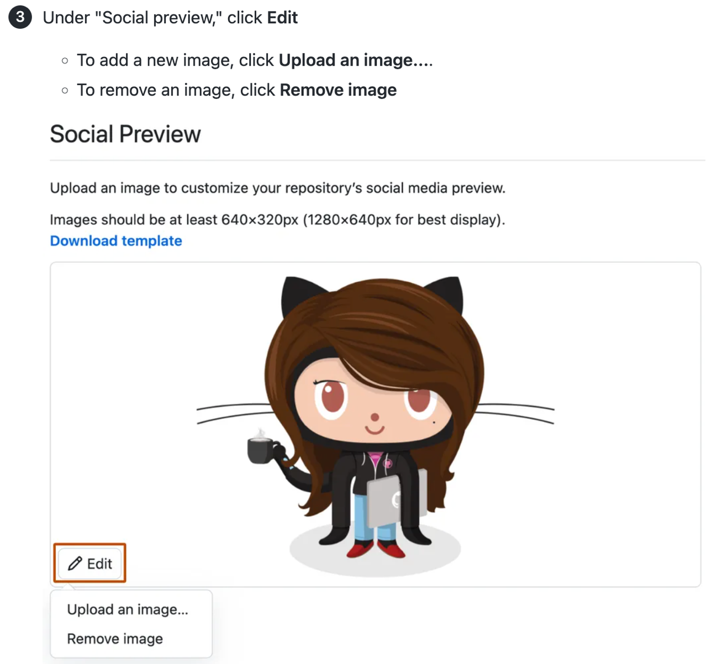
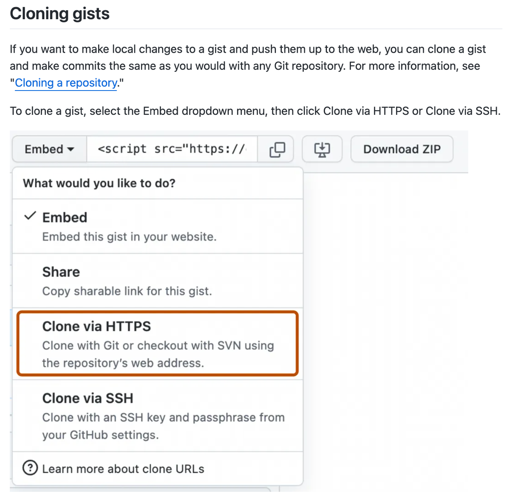
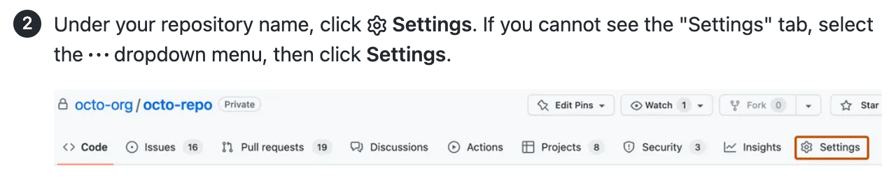

# Creating and updating screenshots

Screenshots complement text instructions for using GitHub.

**Use a screenshot when a user interface element is hard to find:**

- The UI element is small or visually subtle.
- The UI element is not immediately visible. For example, it is contained in a dropdown menu.
- The interface has multiple competing choices that can cause confusion.

Don't use screenshots for simple steps where text does the job, or to show code commands or outputs.

## Examples of screenshots that meet and don't meet criteria

<details>

<summary>✅ Screenshots to include</summary>

- [The UI element is small or visually subtle](#the-ui-element-is-small-or-visually-subtle)
- [The UI element is not immediately visible](#the-ui-element-is-not-immediately-visible)
- [The interface has multiple choices that can cause confusion](#the-interface-has-multiple-choices-that-can-cause-confusion)

### The UI element is small or visually subtle

The edit button for a repository's social media preview image is small and visually unobtrusive. It may be hard to find in the sea of repository settings.

As a bonus, the screenshot gives a visual reference for the aspect ratio required.



### The UI element is not immediately visible

Options to clone a gist are contained under a dropdown menu labeled "Embed."

The screenshot is helpful to locate the correct option in the menu, which is not visible until the dropdown is opened.



### The interface has multiple choices that can cause confusion

There are fully three settings options on a repository page: the repository settings menu itself, the floating gear icon by "About" to edit repository info, and the account settings accessed via the profile picture.

The screenshot is helpful to find the correct option.



</details>

<details>

<summary>❌ Screenshots to omit</summary>

- [The UI element is easy to find](#the-ui-element-is-easy-to-find)
- [The UI has few, straightforward choices](#the-ui-has-few-straightforward-choices)

### The UI element is easy to find

GitHub's "Create repository" button is visually prominent through size, color, and placement. There are few duelling choices.

Text instructions are adequate to help the user complete the step.


### The UI has few, straightforward choices

Simple and straightforward options, such as checking or unchecking a box, do not need a visual support.

Text instructions are adequate to help the user complete the step.

There are also two accessibility implications of including the full sentence of text below the checkbox in the screenshot:

1. It's hard to read for low-sighted users because it's small and not as crisp as HTML text.
2. A person using a screen reader won't have access to the information, because it will not fit within alt text character limits. Including the text in the instructions would remedy this, but be unnecessarily wordy.


</details>

## Pros and cons of screenshots

Consider these factors when planning the screenshot strategy for an article or set of content.

### Pros of screenshots

- Screenshots make articles more visually scannable.
- Screenshots make instructions easier to follow, especially for people who have difficulty reading.
- When supplied with alt text, screenshots help blind and low-vision users collaborate with sighted colleagues.

### Cons of screenshots

- Screenshots privilege sighted users.
- Screenshots add length and load time to articles.
- Screenshots increase the volume of content that needs to be maintained.
- When captured at different pixel dimensions and degrees of zoom, screenshots can look confusing.

## Guidelines for screenshots on GitHub Docs

### Technical specs

- PNG file format
- Static images only
- 144 dpi
- 750–1000 pixels wide for full-column images
- 250KB or less in file size
- Descriptive file names: `gist-embed-link.png` instead of `right_side_page_03.png`

### Accessibility

To be inclusive of all users, screenshots must:

- **Be accompanied by complete instructions** on the webpage, with no information conveyed entirely in visual form.
- **Be full contrast** as in the interface itself, with nothing obscured or reduced in opacity or color contrast.
- **Have alt text** that describes the content of the image and the appearance of its highlighting, if any. [See alt text guidelines in our style guide.](./content-style-guide.md#alt-text)
- **Be clear and crisp**, with text and UI elements as legible as possible.

#### No animated GIFs

Animated GIFs are not accessible. According to [WCAG 2.1 2.2.2](https://www.w3.org/WAI/WCAG21/Understanding/pause-stop-hide.html), motion that starts automatically or that lasts more than five seconds must have a pause, stop, or hide mechanism.

Use text or static images instead.

### Visual style

- Show a UI element with **just enough surrounding context** to help people know where to find it on their screen.
- **Reduce negative space**, for example in input fields, by resizing your browser window until optimal.
- Show interfaces in **light theme** wherever possible.
  - For GitHub, select **Light default** in your account's [appearance settings](https://github.com/settings/appearance).
  - For VSCode, select **GitHub light default** in the free [GitHub Theme extension](https://marketplace.visualstudio.com/items?itemName=GitHub.github-vscode-theme).
  - If the software you need to screenshot is available in dark mode only, it's fine to use dark mode.
- If your username and avatar appear, replace them with **Octocat's username and avatar**. [Find the Octocat avatar here.](https://avatars.githubusercontent.com/u/583231?v=4) Use the developer tools in your browser to replace your username with `@octocat` and to replace the URL of your avatar with the URL for Octocat's avatar, `https://avatars.githubusercontent.com/u/583231?v=4`.
- Do not include a **cursor**.

  

#### Visual style for dropdown menus

If the primary goal in showing a dropdown menu is to help the reader locate the menu itself, show the menu closed:


If the primary goal in showing a dropdown menu is to help the reader distinguish among options within the menu, show the menu open. Capture open menus without focus (cursor or hover state). Showing menu items with a white background ensures contrast with the dark orange outline, where present:


## Adding highlighting in Snagit

Use [Snagit](https://www.techsmith.com/screen-capture.html) to apply a contrasting stroke around the UI element being discussed.

The stroke is GitHub Primer color `fg.severe` (HEX #BC4C00 or RGB 188, 76, 0). This dark orange has good color contrast on both white and black. To check contrast on other background colors, use the [Color Contrast Analyzer](https://www.tpgi.com/color-contrast-checker/).


### Importing the GitHub Docs theme into Snagit

1. Download [`snagit-theme-github-docs.snagtheme`](./images/snagit-theme-github-docs.snagtheme) to your computer. Select the **Raw** tab, right-click the page, select "**Save as**," and save the file.
2. Open Snagit and select the **Shape** tool.
3. Under "**Quick styles**," select **Import**.
4. Select the Snagit theme from your computer's files. This will install the shape preset.
5. Optionally, star the dark orange rectangle to add it to your favorites.

### Adding a highlight to a screenshot

1. Open a screenshot in Snagit.
2. Open the "**Resize image**" dialog below the image canvas to set pixel depth (resolution) and pixel width. On Windows, you may need to select **Advanced** to change the resolution. Ensure **Use resampling** is off.
   - pixel depth: 144dpi (equivalent to "2x" on Snagit for Mac)
   - pixel width: 1000 pixels maximum
3. With the GitHub Docs theme open in the Shapes sidebar, select the dark orange rectangle.
4. Drag and drop across the image to create a rectangle. Adjust height and width by dragging edges. Do not adjust the corner rounding, which should remain 4 px.
5. Adjust the space between the UI element and the stroke so it's about the width of the stroke itself.
6. Export image to PNG.

**Note ⚠️**: A bug in Snagit may corrupt the corner rounding, causing rectangles to become ovals. If this occurs, delete and reinstall the GitHub Docs theme (Windows and Mac), or click and drag the yellow dot at the top right of the shape to reset corner rounding to 4 px (Mac only).

## Replacing screenshots

When replacing an existing image (such as for an updated button in the UI), best practice is to retain the image's filename.

If you must change an image filename, search the docs repository for other references to that image and update all references to the original filename.

If the image is used in deprecated versions of GHES documentation, don't change the filename.
  
## Versioning images in Markdown content

Some images apply to all GitHub plans (Free, Pro and Team; GitHub Enterprise Server; GitHub AE; and GitHub Enterprise Cloud). In this case, there is no versioning required.

When an image does differ from plan to plan or changes in a newer release of GitHub Enterprise server or GitHub AE, the images need to be versioned with [Liquid](liquid-helpers.md) conditional statements. The Liquid conditional versioning may need to be added when the content is initially created, or may need to be added when the content is updated for a feature update or Enterprise release.

### Image locations

Images are located in the `/assets/images` directory. This directory has some folders that can be used to organize content by plan and release number.

- `/assets/images/enterprise/github-ae`: Images that are _only_ applicable to GitHub AE (and not applicable to any other plan).
- `/assets/images/enterprise/enterprise-server`: Images that are applicable to _all_ releases of GitHub Enterprise Server or are applicable to the current release and future releases.
- `/assets/images/enterprise/<release number>`: Ex: `/assets/images/enterprise/3.0/`. When an image is changed in a new GitHub Enterprise Server release, add the new image and move the old image to the directory corresponding to the last release that it should be displayed in.
- `/assets/images`: Images that apply to the Free, Pro, Team plan or images that are not specific to any Enterprise plan.

### Example: An image differs between free-pro-team and all Enterprise plans

When there are slight or even drastic differences between the free-pro-team image and the associated Enterprise image (Server or GitHub AE), you can use Liquid conditionals to version the two images.

```markdown



```

### Example: An image is updated in a new Enterprise Server release

Going further with the example ☝️, let's say that the enterprise version of the `foo/bar.png` image will change in the upcoming release 3.1 and the updated image will be used for all future versions of Enterprise. In this case, you would move the existing `/assets/images/enterprise/foo/bar.png` image to `/assets/images/enterprise/3.0`. You will then add the new 3.1 image back to the original location `/assets/images/enterprise/foo/bar.png`.

Your Liquid conditional would look like this:

```markdown




```

When the 3.0 release is deprecated, the `/assets/images/enterprise/3.0` directory will be removed. 

The numbered release directory should contain images that apply to that release number only or to that release number and earlier. For example, images in `/assets/images/enterprise/2.22` should contain images that apply to 2.22 only or 2.22 and earlier.
