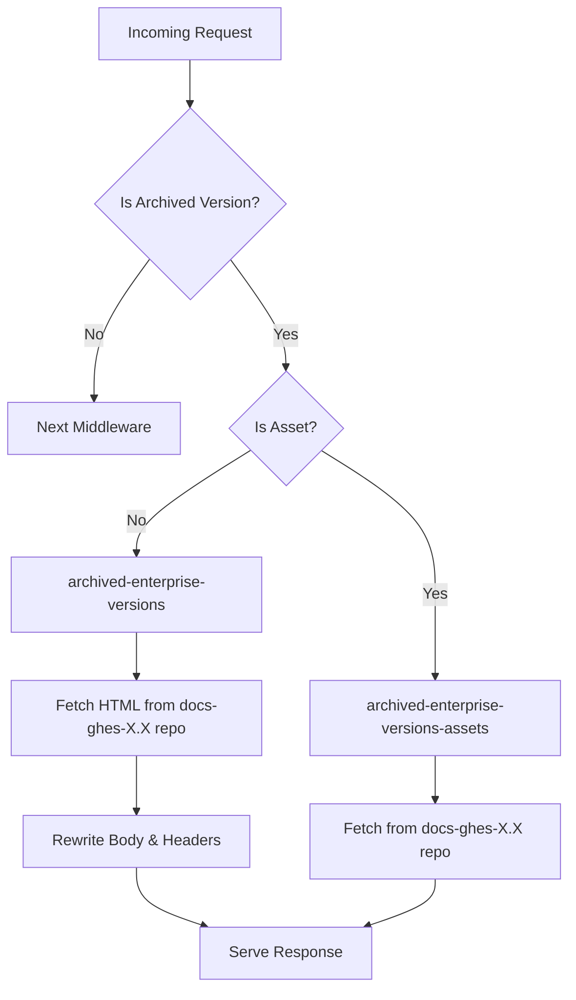

# Archives

This directory contains the infrastructure for serving archived versions of GitHub Docs, primarily for deprecated GitHub Enterprise Server (GHES) releases.

## Purpose & Scope

To keep the main documentation site fast and the build lightweight, we do not build deprecated GHES versions from source. Instead, we serve them as static snapshots. This directory provides the middleware that:

1.  **Detects** requests for archived versions.
2.  **Proxies** the HTML and assets from their static hosting location.
3.  **Rewrites** content on-the-fly to ensure links and assets work correctly within the current site structure.

## Architecture

The system acts as a reverse proxy for specific URL paths.

### Directory Structure

- **`middleware/`**
  - `archived-enterprise-versions.ts`: The primary handler. It:
    - Checks if a URL belongs to a deprecated version.
    - Fetches the content from the external host.
    - Rewrites HTML (e.g., fixing image paths, injecting new headers).
    - Handles redirects defined in the archived version's `redirects.json`.
  - `archived-enterprise-versions-assets.ts`: Proxies static assets (CSS, JS, fonts) from the archive host.
  - `archived-asset-redirects.ts`: Maps legacy asset paths to modern equivalents where possible.
- **`lib/`**
  - `is-archived-version.ts`: Utilities to parse URLs and check against the list of deprecated versions defined in `src/versions`.
- **`scripts/`**
  - `warmup-remotejson.ts`: Utility to prime caches for remote JSON files.

### Request Flow

## Data & External Dependencies

### External Hosting
Archived versions are hosted as static sites on GitHub Pages, typically in repositories named `github/docs-ghes-<version>`.
- **Source**: `https://github.github.com/docs-ghes-<version>`
- **Content**: These repos contain the fully built static HTML and assets for that version at the time of its deprecation.

### Internal Dependencies
- **`src/versions`**: The `deprecated` array in `src/versions/lib/enterprise-server-releases.ts` is the source of truth for which versions are handled by this middleware.
- **`src/frame`**: Uses shared patterns and fetch utilities.

## Setup & Usage

This functionality is enabled by default in the application.

### Local Development
To test archived versions locally:
1. Ensure you have internet access (the middleware fetches from public URLs).
2. Navigate to a deprecated version URL, e.g., `http://localhost:4000/enterprise-server@3.0`.

### Adding a New Archive
When a GHES version is deprecated:
1. A static snapshot is created and pushed to a `docs-ghes-<version>` repository.
2. The version is moved to the `deprecated` list in `src/versions/lib/enterprise-server-releases.ts`.
3. This middleware automatically starts handling requests for that version.

## Ownership & Cross-links

- **Owner**: Docs Engineering
- **Related Code**:
  - `src/versions`: Version configuration.
  - `src/ghes-releases`: Release lifecycle management.

## Current State & Next Steps

- **Health**: The system is stable (KTLO) but relies on the availability of the external GitHub Pages sites. A new version is deprecated and added to this system approximately once per quarter.
- **Known Issues**:
  - "Flash of content" or layout shifts can occur if CSS proxies are slow.
  - Search is generally disabled or limited for archived versions.
