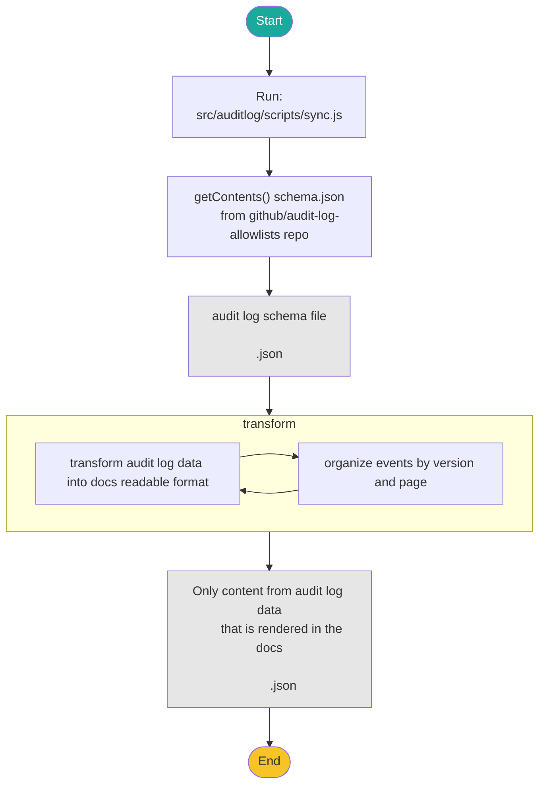

# Audit log event pipeline

The audit log event pipeline generates the event data for 3 audit log pages; the [enterprise events page](docs.github.com/admin/monitoring-activity-in-your-enterprise/reviewing-audit-logs-for-your-enterprise/audit-log-events-for-your-enterprise#oauth_access-category-actions), the [organization events page](docs.github.com/organizations/keeping-your-organization-secure/managing-security-settings-for-your-organization/audit-log-events-for-your-organization), and the [user events page](docs.github.com/authentication/keeping-your-account-and-data-secure/security-log-events).  The source data is stored in the private [`github/audit-log-allowlists`](https://github.com/github/audit-log-allowlists) repository.

## How does it work

A [workflow](.github/workflows/sync-audit-logs.yml) is used to trigger the automation of the audit log events documentation. The workflow runs automatically on a daily schedule.

The workflow creates a pull request with audit log event updates and the label `audit-log-pipeline`.  If there is no updated audit log data, a pull request is not created.

The workflow runs the `src/audit-logs/scripts/sync.ts` script.

## Local development

To run the audit log events pipeline locally:

1. Run `npm run audit-log-sync`

## About this directory

- `src/audit-logs/data` - The automatically generated data files created by running this pipeline.
- `src/audit-logs/lib` - The source code used in production to display the audit log event docs and configuration files edited by content and engineering team members.
  - `src/audit-logs/lib/config.json` - A configuration file used to specify metadata about the audit logs pipeline.
- `src/audit-logs/scripts` - The scripts and source code used run the audit logs pipeline, which updates the `src/audit-logs/data` directory.
  - `src/audit-logs/scripts/sync.ts` - The script that runs the audit-logs pipeline.
- `src/audit-logs/tests` - The tests used to verify the audit logs pipeline.

## Content team

The content writers can manually update frontmatter and introductory content in the associated Markdown files:

- `content/authentication/keeping-your-account-and-data-secure/security-log-events.md`
- `content/admin/monitoring-activity-in-your-enterprise/reviewing-audit-logs-for-your-enterprise/audit-log-events-for-your-enterprise.md`
- `content/organizations/keeping-your-organization-secure/managing-security-settings-for-your-organization/audit-log-events-for-your-organization.md `

Automated content gets appended to the end of these files.

To edit the event descriptions and reference links, writers can update https://github.com/github/audit-log-allowlists/blob/main/allowlists/meta.json.  The workflow mentioned above propagates these updates to github/docs-internal once a day.  See https://github.com/github/audit-log-allowlists/blob/main/docs/meta.md for more details about editing the meta.json file.

## How to get help

Slack: `#docs-engineering`
Repo: `github/docs-engineering`

If you have a question about the audit log events pipeline, you can ask in the `#docs-engineering` Slack channel. If you notice a problem with the audit log events pipeline, you can open an issue in the `github/docs-engineering` repository.
