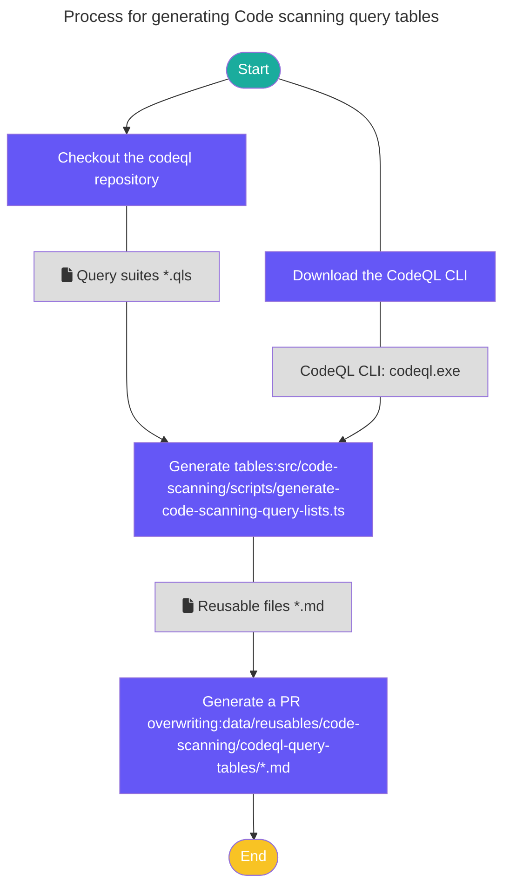

# Code scanning query tables

This nascent pipeline creates autogenerated documentation docs.github.com from the query suites included with the [CodeQL bundle](https://github.com/github/codeql-action/releases).

The pipeline is used to generate Markdown tables that are stored in reusable files and used in article pages on the docs.github.com site.

## How does it work

A [workflow](.github/workflows/generate-code-scanning-query-lists.yml) is used to trigger the automation of the code scanning query tables documentation. The workflow is manually triggered by a member of the GitHub Docs team approximately every two weeks to align to releases of the CodeQL CLI. The workflow takes an input parameter that specifies the branch to pull the source files from in the semmle-code repo. If the branch input is omitted, the workflow will default to the `main` branch.

The workflow runs the `npm run generate-code-scanning-query-list` script, which generates Markdown files under `data/reusables/code-scanning/codeql-query-tables`.

The workflow automatically creates a new pull request with the changes and the label `codeql-query-tables`.

## Local development

To run the pipeline locally, see the comments in the [script](scripts/generate-code-scanning-query-list.ts).

## Content team

The content writers can use the reusables in any content article. They have no need to make any changes to the script unless additional built-in query suites are added.

## How to get help

### For workflow and script problems

Slack: `#docs-engineering`
Repo: `github/docs-engineering`

### For CodeQL repository and CLI problems

Slack: `#code-scanning-internal-dx`
Repo: `github/code-scanning-internal-dx-team`
