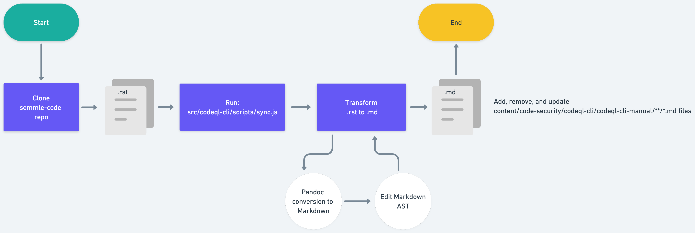

# CodeQL CLI pipeline

Our CodeQL CLI pipeline creates autogenerated documentation for docs.github.com from the source code used to build the [CodeQL CLI](https://docs.github.com/en/code-security/codeql-cli/using-the-codeql-cli/about-the-codeql-cli).

The pipeline is used to generate Markdown files that create article pages on the docs.github.com site.

## How does it work



A [workflow](.github/workflows/sync-codeql-cli.yml) is used to trigger the automation of the CodeQL CLI documentation. The workflow is manually triggered by a member of the GitHub Docs team approximately every two weeks to align to releases of the CodeQL CLI. The workflow takes an input parameter that specifies the branch to pull the source files from in the semmle-code repo. If the branch input is omitted, the workflow will default to the `main` branch.

The workflow runs the `src/codeql-cli/scripts/sync.js` script, which generates Markdown files under `content/code-security/codeql-cli/codeql-cli-manual`.

The workflow automatically creates a new pull request with the changes and the label `codeql-cli-pipeline`.

## Local development

To run the CodeQL CLI pipeline locally:

1. Clone the `semmle-code` repository inside your local `docs-internal` repository.
2. [Install Pandoc](https://pandoc.org/installing.html). You can `brew install pandoc` on macOS.
3. Run `src/codeql-cli/scripts/sync.js`.

## About this directory

- `src/rest/lib/config.json` - A configuration file used to specify metadata about the REST pipeline.
- `src/rest/scripts` - The scripts and source code used run the CodeQL CLI pipeline. 
  - `src/rest/scripts/sync.js` - The entrypoint script that runs the CodeQL CLI pipeline.

## Content team

The content writers can manually update parts of the autogenerated Markdown files in `content/code-security/codeql-cli/codeql-cli-manual`. When new Markdown files are added they will get all of the frontmatter properties defined in the `defaultFrontmatter` property in `src/codeql-cli/lib/config.js`. 

When a new Markdown file is created, a writer can manually change any of the frontmatter. The pipeline will not overwrite the frontmatter on subsequent runs. 

Writers can also add an introduction paragraph _above_ the following Markdown comment:

```markdown
<!-- Content after this section is automatically generated -->
```

## How to get help

Slack: `#docs-engineering`
Repo: `github/docs-engineering`

If you have a question about the CodeQL CLI pipeline, you can ask in the `#docs-engineering` Slack channel. If you notice a problem with the CodeQL CLI pipeline, you can open an issue in the `github/docs-engineering` repository.