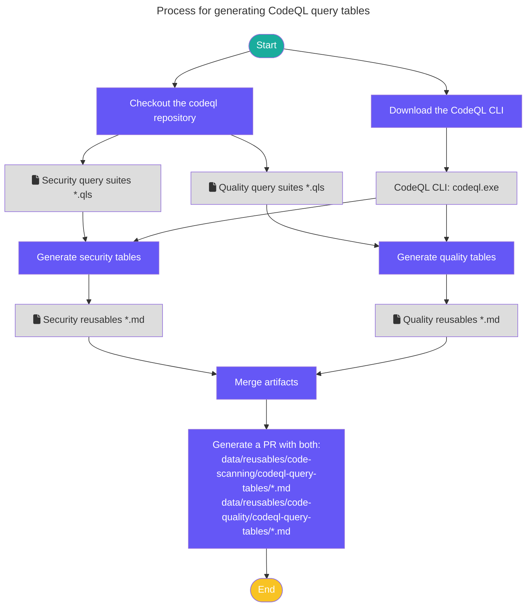

# CodeQL query tables

This pipeline creates autogenerated documentation for docs.github.com from the query suites included with the [CodeQL bundle](https://github.com/github/codeql-action/releases).

The pipeline generates Markdown tables that are stored in reusable files and used in article pages on the docs.github.com site.

There are two types of query table generators:

1. **Security queries** (`generate-code-scanning-query-list.ts`) - generates tables for security-related queries from the `code-scanning` and `security-extended` suites, including CWE information and autofix support.
2. **Code quality queries** (`generate-code-quality-query-list.ts`) - generates tables for code quality queries from the `code-quality` suite, showing query categories (reliability, maintainability).

## How does it work

A [workflow](../../.github/workflows/generate-codeql-query-lists.yml) is used to trigger the automation of the CodeQL query tables documentation. The workflow is manually triggered by a member of the GitHub Docs team approximately every two weeks to align to releases of the CodeQL CLI. The workflow takes an input parameter that specifies the branch to pull the source files from in the codeql repo. If the branch input is omitted, the workflow will default to the `main` branch.

The workflow runs two scripts in parallel:
- `npm run generate-code-scanning-query-list` - generates security query tables under `data/reusables/code-scanning/codeql-query-tables/`
- `npm run generate-code-quality-query-list` - generates code quality query tables under `data/reusables/code-quality/codeql-query-tables/`

The workflow automatically creates a new pull request with changes from both scripts and the label `codeql-query-tables`.

## Local development

To run the pipeline locally, see the comments in the scripts:
- Security queries: [generate-code-scanning-query-list.ts](scripts/generate-code-scanning-query-list.ts)
- Code quality queries: [generate-code-quality-query-list.ts](scripts/generate-code-quality-query-list.ts)

## Content team

The content writers can use the reusables in any content article. They have no need to make any changes to the scripts unless additional built-in query suites are added.

For security queries, reusables are stored in `data/reusables/code-scanning/codeql-query-tables/`.
For code quality queries, reusables are stored in `data/reusables/code-quality/codeql-query-tables/`.

## How to get help

### For workflow and script problems

Slack: `#docs-engineering`
Repo: `github/docs-engineering`

### For CodeQL repository and CLI problems

Slack: `#code-scanning-engine-quality`
Repo: `github/code-scanning-engine-quality-team`
