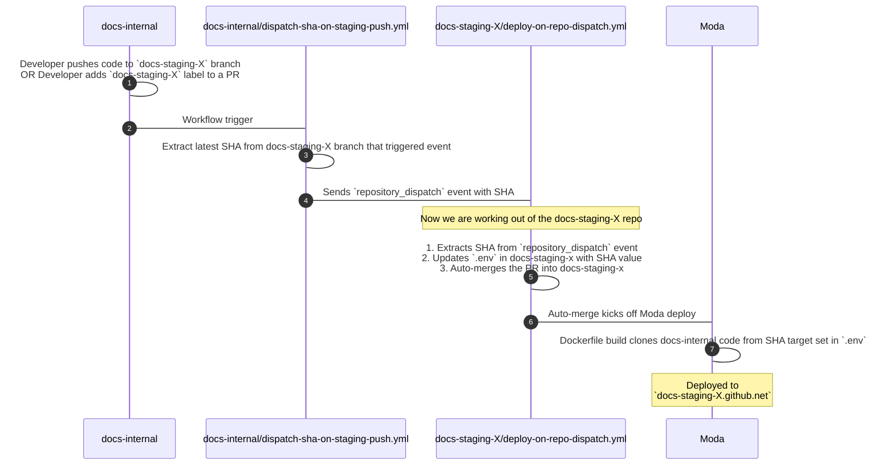

# Staging Servers

This directory contains the build tools, workflows, and files used to build and deploy our staging (and dedicated review) servers.

For internal documentation, please see the Moda directory in the internal Docs Engineering repo.

1. [Why staging servers?](#why-staging-servers)
1. [What are staging servers?](#what-are-staging-servers)
1. [How do staging deploys work from docs-internal?](#how-do-staging-deploys-work-from-docs-internal)
1. [How do review server deploys work from docs-internal?](#how-do-review-server-deploys-work-from-docs-internal)
1. [Keeping build configurations in sync](#keeping-build-configurations-in-sync)

## Why staging servers?

Previously, Docs had automatic preview deploys for each branch. When a PR was opened, a dedicated server was spun up from the contents of that branch.

In the future, we may be able to accomplish automatic branch deploys again if Moda's features are expanded.

Until then, we have staging servers that we manually push changes from a branch to spin up.

We have 8 dedicated staging servers that developers can use to test their code changes. For purely content changes we use the [review server](../review-server/README.md) which automatically previews content changes on a remote branch.

The dedicated review servers are deployed in a similar fashion that the staging servers are. The difference is that review servers have different environment variables set in `.env` and two additional secrets, like a PAT for reading from remote repos and an access token.

## What are staging servers?

Each staging server requires its own `github/` repo in order to deploy to Moda in the form of `github/docs-staging-X` where X is the number of that staging server e.g. `github/docs-staging-0` or `github/docs-staging-1`.

The URLs of the staging servers also follow this pattern, `docs-staging-x.github.net`, e.g. `docs-staging-2.github.net`

With the exception of the first 2 which are our review servers:

- `docs-staging-0` -> https://docs-review.github.com
- `docs-staging-1` -> https://os-docs-review.github.com

Ideally there should always be enough staging servers for each developer on the team to have a dedicated server to deploy to while they are on the team.

So we have 8 dedicated staging servers, `docs-staging-{2-9}`:

- `docs-staging-2` -> https://docs-staging-2.github.net
- `docs-staging-3` -> https://docs-staging-3.github.net
- etc
- `docs-staging-9` -> https://docs-staging-9.github.net

## How do staging deploys work from docs-internal?

Whenever a developer pushes code to a staging branch in `docs-internal`, e.g. `docs-staging-2`, a pipeline begins with the final result being a staging server running with the latest changes from that branch. See the above diagram, or read below for a textual explanation.

The pipeline is as follows:

1. Pushing to a `docs-staging-X` branch on `docs-internal` triggers the [dispatch-sha-on-staging-push.yml](../../.github/workflows/dispatch-sha-on-staging-push.yml) workflow in `docs-internal` that fires a [repository_dispatch](https://docs.github.com/en/actions/writing-workflows/choosing-when-your-workflow-runs/events-that-trigger-workflows#repository_dispatch) event to the `docs-staging-X` repo corresponding to the `docs-staging-X` branch that was pushed to.

1. The `repository_dispatch` event will include the latest `SHA` from the `docs-staging-X` branch in its payload.

1. The repo receiving the `repository_dispatch` event, `docs-staging-X` has a `deploy-on-repo-dispatch.yml` workflow that triggers whenever a `repository_dispatch` event is received.

1. `deploy-on-repo-dispatch.yml`:

   1. Extracts the `SHA` from the `repository_dispatch` payload
   2. Opens a PR replacing the existing `SHA` in the `.env` file in the repo with the new `SHA`
   3. Automatically merges the PR

1. The PR merge kicks off an automatic Moda deploy for the `docs-staging-X` server.

1. At build time, the [Dockerfile](./Dockerfile) clones the `SHA` from `docs-internal` and builds, runs, and deploys it to https://docs-staging-X.github.net which is only accessible behind the devvpn.

## How do review server deploys work from docs-internal?

The process is very similar to the process in the previous section for staging servers. The differences are as follows:

1. Review servers live in:
   1. Repo [docs-staging-0](https://github.com/github/doc-staging-0) (internal) @ https://docs-review.github.com
   1. Repo [docs-staging-1](https://gthub.com/github/doc-staging-1) (external) @ https://os-docs-review.github.com

1. When a _code_ change happens in `main` e.g. `.ts` or `.js` file is changed, the `update-review-servers-on-code-push.yml` runs instead of `update-docs-staging-x-repo.yml` in the docs-internal repo.
1. The `STAGING_BRANCH` in the these repos is set to `main` since they pull and run the latest code from `main`
1. The `SHA=` is set to the latest commit in `main` using the same process that staging servers use to deploy (repo dispatch from `docs-internal` to `docs-staging-X`)

The primary reason for this is that the review servers need to be up to date with the latest _code_ changes with `docs-internal:main` so that they can accurately live preview content changes on branch targets. They don't need to be deployed each time just to preview content changes. They only need to be deployed when code changes, hence the separate process.

Additionally, the review server is running the code from `main` instead of a staging branch, like `docs-staging-0`.

## Keeping build configurations in sync

Since we may increase or decrease the number of staging servers, repos, and branches e.g. `docs-staging-X+1`, we centralize all of the build config in the `src/deployments/staging` directory of this repo.

Each of the following files & directories are synced when changed between each of the `docs-staging-X` repos using the [sync-staging-repo-files.yml](../../.github/workflows/sync-staging-repo-files.yml) workflow.

The source of truth for the number of staging repos is in [src/deployments/staging/config.json](./config.json) along with other data like the domain names of each server.

- The [Dockerfile](./Dockerfile) in `src/deployments/staging/Dockerfile` is the same Dockerfile that lives in each of the `docs-staging-X` repos.

- The [src/deployments/staging/workflows](./workflows/) workflows are the same workflows that live in each of the `docs-staging-X` repo's `.github/.workflows/` directory.

- The [build-scripts/](./build-scripts) directory live in the staging repo's `build-scripts` directory

> [!NOTE]
> The `.env` in each repo is unique to that repo since it stores that repo's `SHA` and in the case of the dedicated review server, `REVIEW_SERVER=`. The Dockerfile reads the `.env` file at build time and extracts the env variables into its environment.

> [!NOTE]
> Each `docs-staging-X` repo must have `docs-bot` as a member with `write` access to enable syncing
