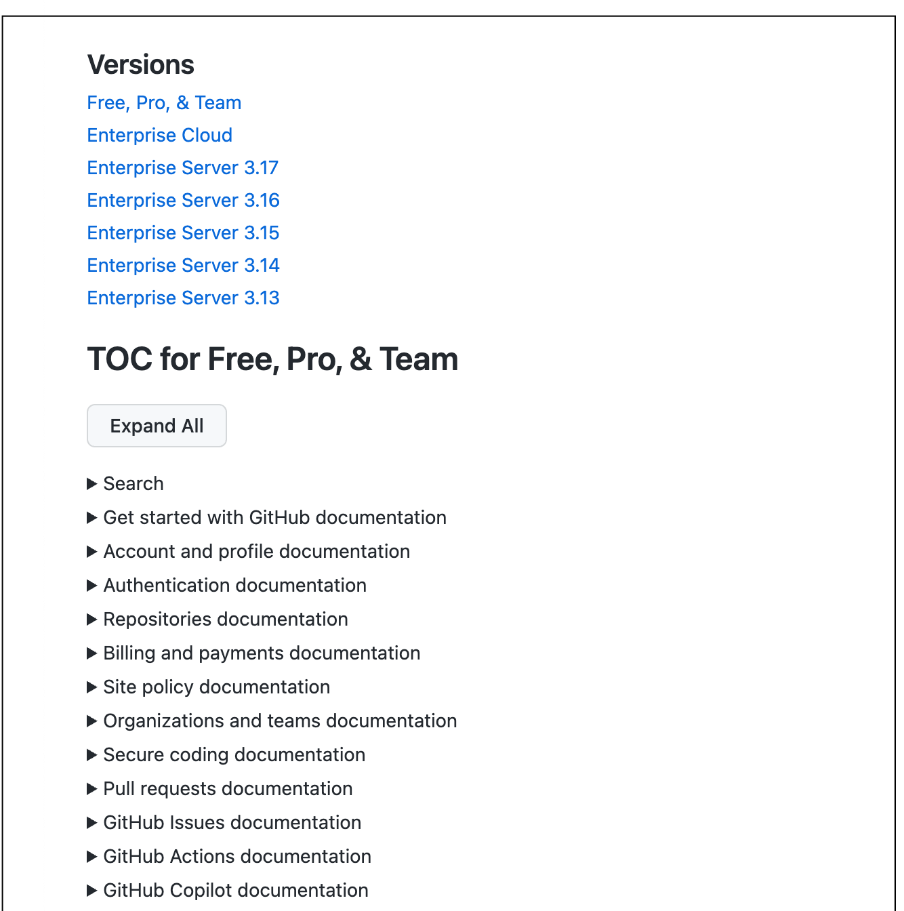

# Developer table of contents

The dev-toc subject generates a static, browsable table of contents (TOC) for local development. It creates HTML files showing the complete documentation site structure across all versions, making it easy to navigate and verify the site hierarchy during development.

## Purpose & Scope

This subject is responsible for:
- Generating static HTML TOC files for all versions
- Rendering page titles with Liquid templating
- Creating expandable/collapsible navigation tree
- Supporting auto-expansion of specific product sections
- Opening generated TOC in browser automatically
- Developer tool for site navigation and verification



## Architecture & Key Assets

### Key capabilities and their locations

- `generate.ts` - Main script that builds TOC HTML files for all versions
- `layout.html` - HTML template with expandable/collapsible tree structure
- `static/` - Output directory containing generated `index.html` files per version (not committed)

## Setup & Usage

### Generating the TOC

Generate the complete table of contents:

```bash
npm run dev-toc
```

This will:
1. Generate HTML files in `src/dev-toc/static/` for each version
2. Render all page titles (including Liquid templates)
3. Open the TOC in your default browser at the FPT version

If it doesn't open automatically, navigate to the generated file in your browser.

### Auto-expanding specific sections

Generate TOC with specific product sections pre-expanded:

```bash
tsx src/dev-toc/generate.ts -o actions
```

Multiple sections:
```bash
tsx src/dev-toc/generate.ts -o actions copilot pull-requests
```

Where product IDs match the URL structure (e.g., `actions` for `https://docs.github.com/en/actions`).

Note: If regenerating with different flags, refresh your browser to see changes.

### What gets generated

For each version, the script:
1. Loads the site tree for that version
2. Recursively renders all page titles (handles Liquid templating)
3. Builds an HTML tree with expandable/collapsible sections
4. Writes to `static/{version}/index.html`

## Data & External Dependencies

### Data inputs
- Site tree from content files (all pages and their hierarchy)
- Page frontmatter (titles, which may include Liquid)
- Version information from `@/versions/lib/all-versions`

### Dependencies
- `@/frame/middleware/context/context` - Context initialization
- `@/content-render` - Liquid template rendering
- `@/versions` - Version enumeration
- HTML template in `layout.html`
- Browser (for opening generated TOC)

### Data outputs
- Static HTML files in `static/` directory
- One `index.html` per version
- Expandable tree navigation with page links
- Links that can open in VS Code or browser

## Cross-links & Ownership

### Related subjects
- [`src/frame`](../frame/README.md) - Site tree structure and context
- [`src/content-render`](../content-render/README.md) - Liquid rendering for titles
- [`src/versions`](../versions/README.md) - Version enumeration
- Content files - Source of page hierarchy

### Ownership
- Team: Docs Content (with engineering support and reviews as needed)

## Current State & Next Steps

### Use cases

The dev-toc is useful for:
- **Navigation** - Quickly browse entire site structure during development
- **Verification** - Check that pages appear in correct hierarchy
- **Title debugging** - See rendered titles (including Liquid output)
- **Structure review** - Review content organization across versions
- **Link checking** - Verify navigation structure makes sense

### Known limitations
- Generated files are static (don't auto-update when content changes)
- Must regenerate when content structure changes
- Only shows structure, not content
- Requires re-running script to see updates
- Links open file paths, not the dev server

### Output directory
The `static/` directory is gitignored because it contains generated files that vary by local environment.

### Development workflow

Common pattern:
1. Make content structure changes
2. Run `npm run dev-toc`
3. Review structure in generated TOC
4. Verify pages appear in correct locations
5. Check that parent/child relationships are correct

### Troubleshooting

**TOC doesn't open:**
Manually navigate to `src/dev-toc/static/free-pro-team@latest/index.html` in your file browser.

**Missing pages:**
- Ensure content files have proper frontmatter
- Check that pages are included in parent's `children` array
- Regenerate TOC after content changes

**Liquid rendering errors:**
Check console output when running `generate.ts` for template errors.

**Wrong sections expanded:**
Regenerate with correct `-o` flags, then refresh browser (hard refresh may be needed).

