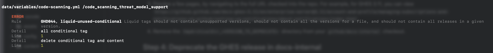

# Deprecation steps for GHES releases

The day after a GHES version's [deprecation date](https://github.com/github/docs-internal/tree/main/src/ghes-releases/lib/enterprise-dates.json), a banner on the docs will say: `This version was deprecated on <date>.` This lets users know that the release is deprecated. However, until the release is fully deprecated, it will show up in the Versions dropdown on the docs.github.com site.

When we fully deprecate the release, we remove all any content (YML, JSON, Markdown) versioned for that release or lower. Follow the steps in this issue to fully **deprecate** the docs.

**Note**: Each step below, except step 0, must be done in order. Only move on to the next step after successfully completing the previous step.

The following large repositories are used throughout this checklist, it may be useful to clone them before you begin:

- `github/github`
- `github/docs-internal`

## Step 0: Confirm the deprecation date

Before beginning the deprecation, ensure the date of the deprecation is correctly defined:

1. Check that the deprecation date is correct by looking up the version you are deprecating in the [release date list](https://github.com/github/enterprise-releases/blob/master/releases.json) and finding the corresponding `prp` owner. Send them a slack message to confirm that the date is correct. If the date is being pushed out, you can ask the `prp` to update the date in the release date list. If the release date list does not get updated (it doesn't always) we have to prepare that our version of that file (`src/ghes-releases/lib/enterprise-dates.json`) will also be inaccurate.

   If there is no `prp` defined, reach out to our content friends for help in the #docs-content-enterprise or #ghes-releases Slack channel.

1. If this release is being pushed out, update the target date of this issue and you can wait to proceed with any futher steps.

1. In the `docs-content` repo, remove the deprecated GHES version number from the `options` list in [`release-tracking.yml`](https://github.com/github/docs-content/blob/main/.github/ISSUE_TEMPLATE/release-tracking.yml).

1. When the PR is approved, merge it in.

<details><summary><strong>🤖 Copilot prompt for Step 0</strong></summary>

> I'm preparing to deprecate GHES VERSION_NUMBER. Read `src/ghes-releases/lib/enterprise-dates.json` in docs-internal and find the deprecation date for this version. Then draft a Slack message I can send to the PRP owner to confirm the date is correct. Also check `github/enterprise-releases/releases.json` and identify the PRP owner for this version.

</details>

## Step 1: Create the new archived repository

All previously archived content lives in its own repository. For example, GHES 3.11 archived content is located in https://github.com/github/docs-ghes-3.11.

1. Create a new repository that will store the scraped deprecated files:

   ```shell
   npm run deprecate-ghes -- create-repo --version <release to deprecate>
   ```

   For example, to deprecate GHES 3.11, you would run:

   ```shell
   npm run deprecate-ghes -- create-repo --version 3.11
   ```

1. From the new repository's home page, click the gear icon next to the "About" section and deselect the "Releases", "Packages", and "Deployments" checkboxes. Click "Save changes".

<details><summary><strong>🤖 Copilot prompt for Step 1</strong></summary>

> Run `npm run deprecate-ghes -- create-repo --version VERSION_NUMBER` and show me the output. If the script fails (API errors, permission issues, path problems), diagnose the error and suggest a fix. The `create-docs-ghes-version-repo.sh` script may have hardcoded paths or assumptions that need updating.

</details>

## Step 2: Dry run: Scrape the docs and archive the files

**Note:** You may want to perform the following dry run steps on a new temporary branch that you can delete after the dry run is complete.

1. If the release date documented in the [release date list](https://github.com/github/enterprise-releases/blob/master/releases.json) is incorrect or differs from what we have documented in `src/ghes-releases/lib/enterprise-dates.json`, update the date in `src/ghes-releases/lib/enterprise-dates.json` to the correct deprecation date before proceeding with the deprecation. A banner is displayed on each page with a version that will be deprecated soon. The banner uses the dates defined in `src/ghes-releases/lib/enterprise-dates.json`.

1. Ensure you have local clones of the [translation repositories](#configuring-the-translation-repositories).

1. Update all translation directories to the latest `main` branch.

1. Hide search components temporarily while scraping docs by adding the `visually-hidden` class to the search components:

   **In `src/search/components/input/SearchBarButton.tsx`**, wrap the return statement content:

   ```javascript
   return (
     <div className="visually-hidden">
       {/* existing search button content */}
     </div>
   );
   ```

   **In `src/search/components/input/SearchOverlayContainer.tsx`**, wrap the return statement content:

   ```javascript
   if (isSearchOpen) {
     return (
       <div className="visually-hidden">
         <SearchOverlay
         // ... existing props
         />
       </div>
     );
   }
   ```

1. Ensure your build is up to date:

   ```shell
   npm run build
   ```

1. Do a dry run by scraping a small amount of files to test locally on your machine. This command does not overwrite the references to asset files so they will render on your machine.

   ```shell
   npm run deprecate-ghes-archive -- --dry-run --local-dev
   ```

1. Navigate to the scraped files directory (`tmpArchivalDir_<VERSION_TO_DEPRECATE>`) inside your docs-internal checkout. Open a few HTML files and ensure they render and drop-down pickers work correctly.

1. If the dry-run looks good, scrape all content files. This will take about 20-30 minutes. **Note:** This will overwrite the directory that was previously generated with new files. You can also create a specific output directory using the `--output` flag.

   ```shell
   npm run deprecate-ghes-archive
   ```

1. Revert changes to `src/search/components/input/SearchBarButton.tsx` and `src/search/components/input/SearchOverlayContainer.tsx`.

1. Check in any change to `src/ghes-releases/lib/enterprise-dates.json`.

<details><summary><strong>🤖 Copilot prompt for Step 2</strong></summary>

> I'm doing a dry run of the GHES VERSION_NUMBER deprecation archive scrape.
>
> First, in `src/search/components/input/SearchBarButton.tsx`, wrap the return statement content in a `<div className="visually-hidden">` wrapper. Do the same in `src/search/components/input/SearchOverlayContainer.tsx` for the SearchOverlay component when `isSearchOpen` is true.
>
> Then run `npm run build` and show me the output. If the build succeeds, run `npm run deprecate-ghes-archive -- --dry-run --local-dev` and show me the output. Tell me if any errors occurred.
>
> After I've reviewed the dry run output, run the full scrape: `npm run deprecate-ghes-archive`. This will take 20-30 minutes.
>
> When the scrape completes, revert the search component changes: `git checkout src/search/components/input/SearchBarButton.tsx src/search/components/input/SearchOverlayContainer.tsx`. Verify the files are reverted.

</details>

## Step 3: Commit the scraped docs to the new repository

1. Copy the scraped files from the `tmpArchivalDir_<VERSION_TO_DEPRECATE>` directory in `docs-internal` over to the new `github/docs-ghes-<RELEASE_NUM>` repository.

1. Commit the files. A GitHub Pages build should automatically begin, creating the static site that serves these docs.

1. Preview a few pages, by navigating to the full URL checked into the repo. For example, for GHES 3.11, you can view `https://github.github.com/docs-ghes-3.11/en/enterprise-server@3.11/account-and-profile/managing-subscriptions-and-notifications-on-github/setting-up-notifications/about-notifications/index.html`.

1. Remove the `tmpArchivalDir_<VERSION_TO_DEPRECATE>` directory from your `github/docs-internal` checkout.

<details><summary><strong>🤖 Copilot prompt for Step 3</strong></summary>

> Copy the scraped files from `tmpArchivalDir_<VERSION_TO_DEPRECATE>` to the `github/docs-ghes-<RELEASE_NUM>` repository. Commit all the files with the message "Archive GHES <RELEASE_NUM> docs". Verify the commit succeeded and show me the file count. Then remove the `tmpArchivalDir_<VERSION_TO_DEPRECATE>` directory from docs-internal.

</details>

## Step 4: Deprecate the GHES release in docs-internal

1. In your `docs-internal` checkout, create a new branch: `git checkout -b deprecate-<version>`.

1. In your `docs-internal` checkout, edit `src/versions/lib/enterprise-server-releases.ts` by removing the version number to be deprecated from the `supported` array and move it to the `deprecatedWithFunctionalRedirects` array.

1. Deprecate the automated pipelines data files (including audit logs, REST, GraphQL, webhooks, GitHub Apps, CodeQL CLI, and secret scanning):

   ```shell
   npm run deprecate-ghes -- pipelines
   ```

1. Remove deprecated content files and update the versions frontmatter:

   ```shell
   npm run deprecate-ghes -- content
   ```

1. Remove deprecated Liquid from content and data files. **Note:** The previous step to update content file frontmatter must have run successfully for this step to work because the updated frontmatter is used to determine file versions.

   ```shell
   npm run lint-content -- --paths content data --rules liquid-ifversion-versions --fix
   ```

1. There are some `data/variables/*.yml` files that can't be autofixed. These will show up as errors. You can manually make the changes to these files. For example, this means open file data/variables/code-scanning and find the code_scanning_thread_model_support key. Edit the key’s value to remove the deprecated liquid:

   

1. Deprecate any data files that are now empty, remove data resuables references that were deleted:

   ```shell
   npm run deprecate-ghes -- data
   ```

1. Run the linter again to remove whitespace and check for any other errors:

   ```shell
   npm run lint-content -- --fix
   ```

1. Use VSCode find/replace to remove any remaining table pipes after liquid has been removed. For example lines that only contain 1 or two pipes: ` |` or ` | |`. You can use the following regexes: `^\|\s*\|$` and `^\s?\|\s?$`.

1. Test the changes by running the site locally:

   ```shell
   npm run start
   ```

1. Poke around several deprecated pages by navigating to `docs.github.com/enterprise/<DEPRECATED VERSION>`, and ensure that:

   - Stylesheets are working properly
   - Images are rendering properly
   - The search functionality was disabled during scraping
   - Look at any console errors to ensure that no new unexpected errors were introduced. You can look at previous errors by viewing a previously completed deprecation page.
   - You should see a banner on the top of every deprecated page with the date that the version was deprecated.
   - You should see a banner at the top of every page for the oldes currently supported version with the date that it will be deprecated in the ~3 months.

1. If everything looks good, check in all changes and create a pull request.

1. Ensure that CI is passing or make any changes to content needed to get tests to pass.

1. Add the PR to the [docs-content review board](https://github.com/orgs/github/projects/2936/views/2).

1. 🚢 Ship the change.

<details><summary><strong>🤖 Copilot prompt for Step 4 — initial setup</strong></summary>

> I'm deprecating GHES VERSION_NUMBER in docs-internal. In `src/versions/lib/enterprise-server-releases.ts`, remove `'VERSION_NUMBER'` from the `supported` array and add it as the first element of the `deprecatedWithFunctionalRedirects` array. Show me the diff.

</details>

<details><summary><strong>🤖 Copilot prompt for Step 4 — run deprecation scripts</strong></summary>

> Run `npm run deprecate-ghes -- pipelines` and show me the output. If there are errors, diagnose and fix them.
>
> Then run `npm run deprecate-ghes -- content` and show me the output. If there are errors, diagnose and fix them.

</details>

<details><summary><strong>🤖 Copilot prompt for Step 4 — lint and fix Liquid</strong></summary>

> Run `npm run lint-content -- --paths content data --rules liquid-ifversion-versions --fix`. Some `data/variables/*.yml` files can't be auto-fixed and will show as errors. For each error, open the file, find the key mentioned in the error, and remove the deprecated Liquid conditional for GHES VERSION_NUMBER while preserving the content for supported versions. Show me each change you make.

</details>

<details><summary><strong>🤖 Copilot prompt for Step 4 — clean up data and remaining issues</strong></summary>

> Run `npm run deprecate-ghes -- data` and show me the output.
>
> Then run `npm run lint-content -- --fix` to remove whitespace and check for other errors.
>
> Search the codebase for any remaining table pipe artifacts from removed Liquid conditionals. Look for lines matching `^\|\s*\|$` or `^\s?\|\s?$` across all content and data files. Remove any you find.
>
> Show me a summary of all changes made.

</details>

<details><summary><strong>🤖 Copilot prompt for Step 4 — final validation</strong></summary>

> Run `npm run lint-content` and show me any remaining errors. For each error, fix it and show me the change.
>
> Then run `npm run test -- src/versions` to check version-related tests still pass.
>
> Summarize all changes made so far so I can review before committing.

</details>

## Step 5: Create a tag

1. Create a new tag for the most recent commit on the `main` branch so that we can keep track of where in commit history we removed the GHES release. Create a tag called `enterprise-<release number>-deprecation`. On your local, `git checkout main`, `git pull`, `git tag enterprise-<version>-deprecation`, then `git push --tags --no-verify`.

<details><summary><strong>🤖 Copilot prompt for Step 5</strong></summary>

> Run `git checkout main && git pull` then `git tag enterprise-VERSION_NUMBER-deprecation && git push --tags --no-verify`. Show me the output.

</details>

## Step 6: Deprecate the OpenAPI description in `github/github`

1. In `github/github`, edit the release's config file in `app/api/description/config/releases/`, and change `deprecated: false` to `deprecated: true`.

1. Open a new PR, and get the required code owner approvals. A docs-content team member can approve it for the docs team.

1. When the PR is approved, [deploy the `github/github` PR](https://thehub.github.com/epd/engineering/devops/deployment/deploying-dotcom/). If you haven't deployed a `github/github` PR before, work with someone that has -- the process isn't too involved depending on how you deploy, but there are a lot of details that can potentially be confusing as you can see from the documentation.

<details><summary><strong>🤖 Copilot prompt for Step 6</strong></summary>

> In the `github/github` repository, find the config file for GHES VERSION_NUMBER in `app/api/description/config/releases/`. Change `deprecated: false` to `deprecated: true`. Show me the diff and open a PR with the title "Deprecate GHES VERSION_NUMBER OpenAPI description".

</details>

## Configuring the translation repositories

You can clone the translation repositories directly inside of your docs-internal checkout, but I'd recommend cloning them in a separate directory. For example, create a `translations` directory at the same level as your `docs-internal` directory. Inside of the `translations` directory, clone the following repoisitories (ensure this list includes all languages that we are supporting):

- [docs-internal.es-es](https://github.com/github/docs-internal.es-es)
- [docs-internal.ja-jp](https://github.com/github/docs-internal.ja-jp)
- [docs-internal.pt-br](https://github.com/github/docs-internal.pt-br)
- [docs-internal.zh-cn](https://github.com/github/docs-internal.zh-cn)
- [docs-internal.ru-ru](https://github.com/github/docs-internal.ru-ru)
- [docs-internal.fr-fr](https://github.com/github/docs-internal.fr-fr)
- [docs-internal.ko-kr](https://github.com/github/docs-internal.ko-kr)
- [docs-internal.de-de](https://github.com/github/docs-internal.de-de)

To map the location of each translation repository, edit your `.env` file with the mapping. For example, if following the locations suggested above, your `.env` file might look like this:

```shell
TRANSLATIONS=/Users/mona/repos/github-repos/translations
TRANSLATIONS_ROOT_ES_ES=${TRANSLATIONS}/docs-internal.es-es
TRANSLATIONS_ROOT_JA_JP=${TRANSLATIONS}/docs-internal.ja-jp
TRANSLATIONS_ROOT_PT_BR=${TRANSLATIONS}/docs-internal.pt-br
TRANSLATIONS_ROOT_ZH_CN=${TRANSLATIONS}/docs-internal.zh-cn
TRANSLATIONS_ROOT_RU_RU=${TRANSLATIONS}/docs-internal.ru-ru
TRANSLATIONS_ROOT_FR_FR=${TRANSLATIONS}/docs-internal.fr-fr
TRANSLATIONS_ROOT_KO_KR=${TRANSLATIONS}/docs-internal.ko-kr
TRANSLATIONS_ROOT_DE_DE=${TRANSLATIONS}/docs-internal.de-de
```

## Re-scraping a page or all pages

Occasionally, a change will need to be added to our archived enterprise versions. If this occurs, you can check out the `enterprise-<release number>-release` branch and re-scrape the page or all pages using `npm run deprecate-ghes-archive`. To scrape a single page you can use the `—page <page relative path>` option.

For each language, upload the new file to the `github/docs-ghes-<RELEASE_NUM>` repo.

After uploading the new files, you will need to purge the Fastly cache for the single page. From Okta, go to Fastly and select `docs`. Click `Purge` then `Purge URL`. If you need to purge a whole path, just do a `Purge All`


Enter the URL or path and do a soft purge.


