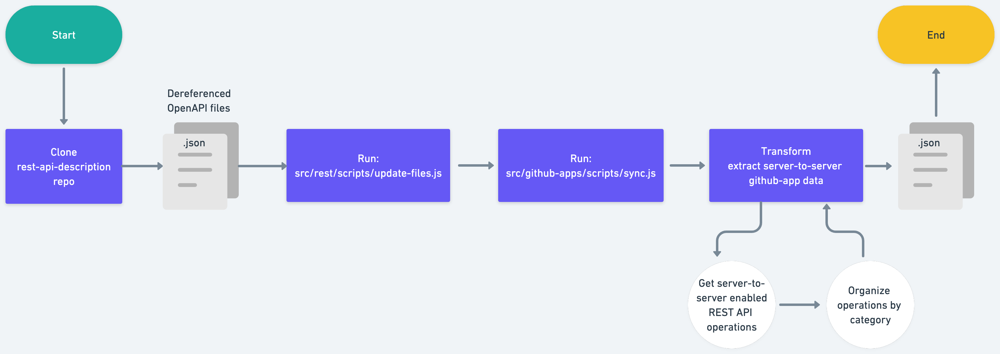

# GitHub Apps pipeline

Our GitHub Apps pipeline creates autogenerated documentation for docs.github.com from the OpenAPI stored in the open-source repository [`github/rest-api-description`](https://github.com/github/rest-api-description).

The pipeline is used to generate data that is used by the docs.github.com site when deployed locally, in preview environments, or in production.

## How does it work



A [workflow](.github/workflows/sync-openapi.yml) is used to trigger the automation of the GitHub Apps documentation. The workflow runs automatically on a schedule. The workflow that triggers the GitHub Apps pipeline also triggers other automation pipelines that use the OpenAPI as the source data:
- GitHub Apps
- REST
- Webhooks

The workflow automatically creates a pull request with the changes (for all three pipelines) and the label `github-openapi-bot`.

The workflow runs the `src/rest/scripts/update-files.js` script.

## Local development

To run the GitHub Apps pipeline locally:

1. Clone the [`github/rest-api-description`](https://github.com/github/rest-api-description) repository inside your local `docs-internal` repository. 
1. Run `src/rest/scripts/update-files.js -s rest-api-description -o github-apps`.

## About this directory

- `src/rest/data` - The automatically generated data files created by running this pipeline.
- `src/rest/lib` - The source code used in production for the automated documentation generated by the GitHub Apps pipeline and configuration files edited by content and engineering team members.
  - `src/rest/lib/config.json` - A configuration file used to specify metadata about the GitHub Apps pipeline. This file contains the SHA of the commit in `github/rest-api-description` that was used to generate the data in `src/github-apps/data`. This value is automatically updated when the pipeline runs.
- `src/rest/scripts` - The scripts and source code used run the GitHub Apps pipeline, which updates the `src/github-apps/data` directory. 
- `src/rest/tests` - The tests used to verify the GitHub Apps pipeline.

## Configuring the pipeline

The `src/github-apps/lib/config.json` file can contain any metadata needed by the content and engineering teams to configure the webhooks pipeline. The file currently only contains the following property:

- `sha` - The SHA of the commit in `github/rest-api-description` that was used to generate the data in `src/github-apps/data`. This value is automatically updated when the pipeline runs.

## Content team

The content writers can manually update parts of the autogenerated Markdown file `content/rest/overview/endpoints-available-for-github-apps.md`. All frontmatter properties except `versions` can be manually modified and will not be overwritten on subsequent runs of the pipeline. The pipeline does update the `versions` property on each run.

Writers can also add an introduction paragraph _above_ the following Markdown comment:

```markdown
<!-- Content after this section is automatically generated -->
```

## How to get help

Slack: `#docs-engineering`
Repo: `github/docs-engineering`

If you have a question about the GitHub Apps pipeline, you can ask in the `#docs-engineering` Slack channel. If you notice a problem with the GitHub Apps pipeline, you can open an issue in the `github/docs-engineering` repository.
