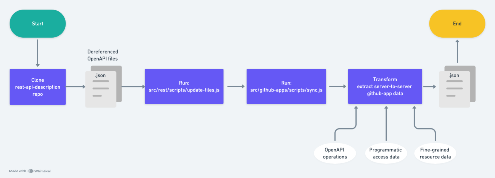

# GitHub Apps pipeline

Our GitHub Apps pipeline creates autogenerated documentation for docs.github.com from the OpenAPI stored in the open-source repository [`github/rest-api-description`](https://github.com/github/rest-api-description).

The pipeline is used to generate the data used on these pages:
- [Endpoints available for Github App installation access tokens](https://docs.github.com/en/rest/authentication/endpoints-available-for-github-app-installation-access-tokens)
- [Endpoints available for GitHub App user access tokens](https://docs.github.com/en/rest/authentication/endpoints-available-for-github-app-user-access-tokens)
- [Endpoints available for fine-grained personal access tokens](https://docs.github.com/en/rest/authentication/endpoints-available-for-fine-grained-personal-access-tokens)
- [Permissions required for GitHub Apps](https://docs.github.com/en/rest/authentication/permissions-required-for-github-apps)
- [Permissions required for fine-grained personal access tokens](https://docs.github.com/en/rest/authentication/permissions-required-for-fine-grained-personal-access-tokens)

## How does it work



A [workflow](.github/workflows/sync-openapi.yml) is used to trigger the automation of the GitHub Apps documentation. The workflow runs automatically on a schedule. The workflow that triggers the GitHub Apps pipeline also triggers other automation pipelines that use the OpenAPI as the source data:

- GitHub Apps
- REST
- Webhooks

The workflow automatically creates a pull request with the changes (for all three pipelines) and the label `github-openapi-bot`.

The data used by the GitHub Apps pages is generated from two sources of programmatic access data and the OpenAPI. Changes to the programmatic access files do not trigger this pipeline to run, but this pipeline can be manually triggered at any time.

## Manually running the pipeline

You can manually sync the data used by the REST, Webhooks, and GitHub App pipelines before the scheduled daily run [here](https://github.com/github/docs-internal/actions/workflows/sync-openapi.yml). Use the default input options.

If the OpenAPI has changed, you will need to first wait for the OpenAPI to be merged into `github/rest-api-description`.

## Local development

To run the GitHub Apps pipeline locally:

1. Clone the [`github/rest-api-description`](https://github.com/github/rest-api-description) repository inside your local `docs-internal` repository. 
1. Set a `GITHUB_TOKEN` in your `.env` with (classic) `repo` scopes & enable SSO for the github org. 
1. Run `npm run sync-rest -- -s rest-api-description -o github-apps`.

## About this directory

- `src/github-apps/components` - The React source code.
- `src/github-apps/data` - The automatically generated data files created by running this pipeline.
- `src/github-apps/lib` - The source code used in production for the automated documentation generated by the GitHub Apps pipeline and configuration files edited by content and engineering team members.
  - `src/github-apps/lib/config.json` - A configuration file used to specify metadata about the GitHub Apps pipeline. This file contains the SHA of the commit in `github/rest-api-description` that was used to generate the data in `src/github-apps/data`. This value is automatically updated when the pipeline runs.
- `src/github-apps/scripts` - The scripts and source code used to run the GitHub Apps pipeline, which updates the `src/github-apps/data` directory.
- `src/github-apps/tests` - The tests used to verify the GitHub Apps pipeline.

## Configuring the pipeline

The `src/github-apps/lib/config.json` file can contain any metadata needed by the content and engineering teams to configure the webhooks pipeline. The file currently only contains the following property:

- `sha` - The SHA of the commit in `github/rest-api-description` that was used to generate the data in `src/github-apps/data`. This value is automatically updated when the pipeline runs.

## Content team

The content writers can manually update parts of the autogenerated Markdown file `content/rest/overview/endpoints-available-for-github-apps.md`. All frontmatter properties except `versions` can be manually modified and will not be overwritten on subsequent runs of the pipeline. The pipeline does update the `versions` property on each run.

Writers can also add an introduction paragraph _above_ the following Markdown comment:

```markdown
<!-- Content after this section is automatically generated -->
```

## How to get help

Slack: `#docs-engineering`
Repo: `github/docs-engineering`

If you have a question about the GitHub Apps pipeline, you can ask in the `#docs-engineering` Slack channel. If you notice a problem with the GitHub Apps pipeline, you can open an issue in the `github/docs-engineering` repository.
