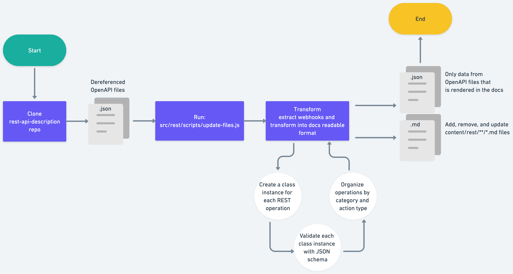

# REST pipeline

Our REST pipeline creates autogenerated REST API documentation for docs.github.com/rest from the OpenAPI stored in the open-source repository [`github/rest-api-description`](https://github.com/github/rest-api-description).

The pipeline is used to generate data that is used by the docs.github.com site when deployed locally, in preview environments, or in production.

## How does it work



A [workflow](.github/workflows/sync-openapi.yml) is used to trigger the automation of the REST documentation. The workflow runs automatically on a schedule. The workflow that triggers the REST pipeline also triggers other automation pipelines that use the OpenAPI as the source data:

- GitHub Apps
- REST
- Webhooks

The workflow automatically creates a pull request with the changes (for all three pipelines) and the label `github-openapi-bot`. The workflow runs the `src/rest/scripts/update-files.js` script, which creates, deletes, or updates Markdown files in the `content/rest` directory.

### Triggering the workflow sooner than the scheduled time

You can manually run the workflow leaving the source branch input parameter with the default value of `main`. Running the workflow creates a new pull request in the `github/docs-internal` repo with the changes.

### Triggering the workflow with a different source branch

If there is a pull request that is still unmerged in `github/rest-api-description` that needs to be propagated to the docs.github.com site, manually run the workflow and provide the branch name of the pull request in the `github/rest-api-description` repo that you would like to get the changes from. This will create a new pull request in the `github/docs-internal` repo with the changes.

## Manually running the pipeline

You will need to first wait for the OpenAPI to be merged into `github/rest-api-description`.

Then, you can manually sync the data used by the REST, Webhooks, and GitHub App pipelines before the scheduled daily run [here](https://github.com/github/docs-internal/actions/workflows/sync-openapi.yml). Use the default input options.

## Local development

To run the REST pipeline locally:

1. Clone the [`github/rest-api-description`](https://github.com/github/rest-api-description) repository inside your local `docs-internal` repository. 
1. Run `src/rest/scripts/update-files.js -s rest-api-description -o rest`. Note, by default `-o rest` is specified, so you can omit it.

## About this directory

- `src/github-apps/api` - API endpoints used by source code in `src/rest`.
- `src/github-apps/components` - The React source code.
- `src/rest/data` - The automatically generated data files created by running this pipeline.
- `src/rest/lib` - The source code used in production for the automated documentation generated by the REST pipeline and configuration files edited by content and engineering team members.
  - `src/rest/lib/config.json` - A configuration file used to specify metadata about the REST pipeline.
- `src/rest/scripts` - The scripts and source code used run the REST pipeline, which updates the `src/rest/data` directory. 
  - `src/rest/scripts/update-files.js` - The entrypoint script that runs the REST pipeline.
- `src/rest/tests` - The tests used to verify the REST pipeline.

## Configuring the pipeline

The `src/rest/lib/config.json` file contain metadata used by the content and engineering team to configure the REST pipeline. The file contains the following properties:

- `api-versions` - A list of the calendar-date API versions that are available for each version.
- `versionMapping` - A mapping of the API version name used in the OpenAPI schema in `github/rest-api-description` to the version short name used in the `github/docs-internal` repo.
- `frontmatterDefaults` - A list of default frontmatter values to append to each Markdown file in `content/rest`.
- `targetDirectory` - The directory in `content` where the Markdown files that correspond to this pipeline are located.
- `indexOrder` - The order of the children in the `index.md` file in the `targetDirectory`. The `startsWith` keyword lists the directories under `targetDirectory` that should be listed first. All other automatically created directories are appended to this list.
- `sha` - The SHA of the commit in `github/rest-api-description` that was used to generate the data in `src/rest/data` and Markdown files in `content/rest`. This value is automatically updated when the pipeline runs.

## Content team

The content writers can manually update parts of the autogenerated Markdown files in `content/rest`. When new Markdown files are added they will get all of the frontmatter properties defined in the `defaultFrontmatter` property in `src/rest/lib/config.js`. 

When a new Markdown file is created, a writer can manually change any of the frontmatter except `versions`. The pipeline will overwrite the `versions` property on subsequent runs, but will not modify any other frontmatter properties.

Writers can also add an introduction paragraph _above_ the following Markdown comment:

```markdown
<!-- Content after this section is automatically generated -->
```

## How to get help

Slack: `#docs-engineering`
Repo: `github/docs-engineering`

If you have a question about the REST pipeline, you can ask in the `#docs-engineering` Slack channel. If you notice a problem with the REST pipeline, you can open an issue in the `github/docs-engineering` repository.