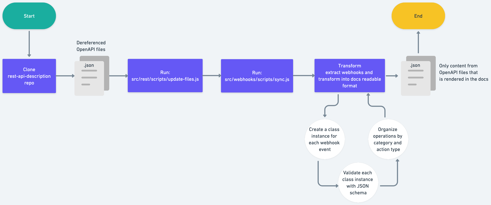

# Webhooks pipeline

Our webhooks pipeline creates autogenerated webhooks documentation for docs.github.com/webhooks-and-events/webhooks/webhook-events-and-payloads from the OpenAPI stored in the open-source repository [`github/rest-api-description`](https://github.com/github/rest-api-description).

The pipeline is used to generate data that is used by the docs.github.com site when deployed locally, in preview environments, or in production.

## How does it work

A [workflow](.github/workflows/sync-openapi.yml) is used to trigger the automation of the webhooks documentation. The workflow runs automatically on a schedule. The workflow that triggers the webhooks pipeline also triggers other automation pipelines that use the OpenAPI as the source data:

- GitHub Apps
- REST
- Webhooks

The workflow automatically creates a pull request with the changes (for all three pipelines) and the label `github-openapi-bot`.

The workflow runs the `npm run sync-rest` script, which then calls the `src/webhooks/scripts/sync.ts` script.

## Manually running the pipeline

You will need to first wait for the OpenAPI to be merged into `github/rest-api-description`.

Then, you can manually sync the data used by the REST, Webhooks, and GitHub App pipelines before the scheduled daily run [here](https://github.com/github/docs-internal/actions/workflows/sync-openapi.yml). Use the default input options.

## Local development

To run the webhooks pipeline locally:

1. Clone the [`github/rest-api-description`](https://github.com/github/rest-api-description) repository inside your local `docs-internal` repository. 
1. Set a `GITHUB_TOKEN` in your `.env` with (classic) `repo` scopes & enable SSO for the github org. 
1. Run `npm run sync-rest -- -s rest-api-description -o webhooks`.

## About this directory

- `src/webhooks/data` - The automatically generated data files created by running this pipeline.
- `src/webhooks/lib` - The source code used in production to display the webhook docs and configuration files edited by content and engineering team members.
  - `src/webhooks/lib/config.json` - A configuration file used to specify metadata about the webhooks pipeline.
- `src/webhooks/scripts` - The scripts and source code used run the webhooks pipeline, which updates the `src/webhooks/data` directory. 
  - `src/webhooks/scripts/sync.ts` - The entrypoint script that runs the webhooks pipeline.
- `src/webhooks/tests` - The tests used to verify the webhooks pipeline.

## Configuring the pipeline

The `src/webhooks/lib/config.json` file can contain any metadata needed by the content and engineering teams to configure the webhooks pipeline. The file currently only contains the following property:

- `sha` - The SHA of the commit in `github/rest-api-description` that was used to generate the data in `src/webhooks/data`. This value is automatically updated when the pipeline runs.

## Content team

The content writers can manually update frontmatter and introductory content in the associated Markdown file `content/webhooks-and-events/webhooks/webhook-events-and-payloads`. Automated content gets appended to the end of the file.

## How to get help

Slack: `#docs-engineering`
Repo: `github/docs-engineering`

If you have a question about the webhooks pipeline, you can ask in the `#docs-engineering` Slack channel. If you notice a problem with the webhooks pipeline, you can open an issue in the `github/docs-engineering` repository.